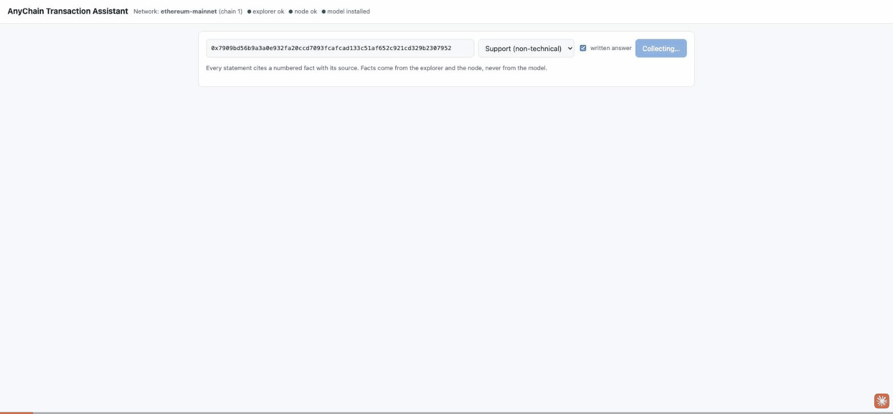
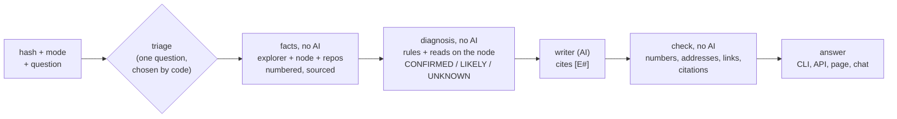

# AnyChain Transaction Assistant

Explains and troubleshoots a transaction on **any EVM network**, for a merchant ("why didn't my payment go through?"), a developer or an auditor. Every statement cites a numbered fact with its source (explorer, node, verified code, repository); the AI only writes from those facts, and a check rejects anything it adds. Switching networks means switching a YAML file.



---

## Start here (for a reviewer with an hour)

1. Watch the GIF above, then run the quickstart below (a few minutes).
2. Read [docs/ARCHITECTURE.md](docs/ARCHITECTURE.md) section 0 ("What this is, in one minute") and section 2 ("How the diagnosis decides").
3. Read the code in this order, each a few hundred lines at its core: `src/anychain/service.py` (one answer, end to end), `bundle.py` (`BundleBuilder.build`: how facts are collected), `diagnosis.py` (`diagnose` and the rules list), `validator.py` (the check on the AI's answer), `writer.py` (the prompts and the three model backends).
4. Skim the sample conversations (section 4) and the evaluation table (section 5).
5. For any choice that looks odd, search [docs/DECISIONS.md](docs/DECISIONS.md) for its number (D1 to D61): each says why, with the real transaction behind it.

---

## 1. Quickstart

Requires Python 3.11+ and [uv](https://docs.astral.sh/uv/). The written answer needs a model: the local [Claude Code](https://claude.com/claude-code) CLI (the default, logged in, no key), or an Anthropic or OpenAI API key, saved once with `anychain llm set` (or the page's **Model** panel) and kept outside the repository, readable by your user only. Without a model, everything still runs and shows the facts only.

```bash
git clone <this repo> anychain && cd anychain
uv sync

# choose the model (skip if Claude Code is installed and logged in); the key is asked for, not shown
uv run anychain llm set --provider anthropic            # or: --provider openai --model <model name>
uv run anychain llm test --config configs/ethereum-mainnet.yaml

# CLI: explain a transaction (a USDC transfer on Ethereum)
uv run anychain explain 0x7909bd56b9a3a0e932fa20ccd7093fcafcad133c51af652c921cd329b2307952 \
  --config configs/ethereum-mainnet.yaml

# the same code on another network, facts only (no model)
uv run anychain explain 0x7db4433fc318dfcf4a8d07022aec6135a5adb69b227f5a82e3092b3a648b0921 \
  --config configs/optimism-mainnet.yaml --no-llm

# a failure, with a question, as JSON
uv run anychain explain 0x73c4c0385483897a8c3cca6e4573c880dab32265bbacd94923fff2466cb45c8a \
  --config configs/ethereum-mainnet.yaml --mode developer --question "why did it fail?" --json

# API + web page on http://127.0.0.1:8000 (this machine only: the API has no authentication)
uv run anychain serve --config configs/ethereum-mainnet.yaml

# follow-up questions in the terminal, evaluation, usage metrics, tests (offline, real recordings)
uv run anychain chat 0x73c4c0385483897a8c3cca6e4573c880dab32265bbacd94923fff2466cb45c8a --config configs/ethereum-mainnet.yaml
uv run anychain eval
uv run anychain metrics --config configs/ethereum-mainnet.yaml
uv run pytest -q
```

With Docker (no secrets in the image; the port is published on the host's 127.0.0.1 only):

```bash
docker build -t anychain .
docker run --rm -p 127.0.0.1:8000:8000 anychain                                   # API + page, Ethereum
docker run --rm anychain anychain explain 0x7909bd56b9a3a0e932fa20ccd7093fcafcad133c51af652c921cd329b2307952 --no-llm
```

Do not run it with `--network host`: inside the container the API listens on 0.0.0.0, which with the host's network means every interface of the host. In a container the Claude Code CLI is not available: for a written answer set `llm.provider: anthropic` (or `openai`) in a mounted config and pass the key as an environment variable at run time.

**Interfaces:** `anychain explain <hash> [--mode support|developer|auditor] [--config path] [--json] [--evidence] [--question "…"] [--no-llm] [--fresh]`, `anychain chat`, `anychain batch <file>`, `anychain serve`, `anychain eval`, `anychain metrics`, `anychain log`, `anychain repos sync`, `anychain llm show|set|test|clear`. API: `POST /explain` (hash, mode, question?, clarified?), `POST /chat` (session_id), `POST /feedback`, `GET /health` (active network; explorer, node and model status), `GET/POST /settings/llm` and `POST /settings/llm/test` (the model and its key; the key is never returned).

---

## 2. Configuration, and retargeting to another network (e.g. CloudWalk)

Everything network-specific is in one YAML file (`configs/*.yaml`); there is no network value in the code (a test enforces it: no explorer or node host, chain id, symbol or address; the only fixed URLs are links to the source of a rule's meaning, such as Uniswap's and OpenZeppelin's code, D31). Eight configs ship: Ethereum, Optimism, Gnosis, Rootstock, Celo, zkSync Era, the private demo network, and the CloudWalk template.

```yaml
network:    { name, chain_id, native_symbol, native_decimals, chain_type }   # chain_type = the explorer's Blockscout CHAIN_TYPE
explorer:   { type: blockscout, base_url, api_path: /api/v2, tx_url_template, address_url_template, timeout_s }
rpc:        { url, timeout_s, supports_debug_trace }                         # read-only JSON-RPC
repos:      [ { url, ref, source_globs, artifact_globs } ]                    # contract sources and ABIs, pinned
abi_strategy: { order: [explorer, repo_artifacts, repo_source_signatures, signature_db] }
llm:        { provider: claude_code | anthropic | openai, model, max_tokens }  # `anychain llm set` overrides it
assistant:  { default_mode, language, max_clarifying_questions, time_budget_s }
storage:    { sqlite_path, cache_dir }
```

**Retargeting to CloudWalk, step by step** (`configs/cloudwalk.example.yaml` is the commented template):

1. Copy the template to `configs/cloudwalk.yaml`.
2. `network`: chain id **2009** (mainnet) or **2008** (testnet), native currency **CWN** (public in chainid.network); `chain_type` as the internal Blockscout runs it (AnyChain warns when the explorer's answers look like another type).
3. `explorer.base_url` and `rpc.url`: the internal addresses (the public explorer names do not answer from outside). Keep `?app=anychain` on the RPC URL: Stratus can reject unidentified clients.
4. `repos`: the BRLC contracts, pinned to a commit (the template points to a public copy of the archived repository; prefer the internal official one).
5. `signature_db.enabled: false` if policy forbids sending selectors to a public service.
6. `uv run anychain repos sync --config configs/cloudwalk.yaml`, then `uv run anychain serve --config configs/cloudwalk.yaml`. `GET /health` confirms the explorer, the node (and that its chain id matches) and the model.

No code change is needed: the same steps took the tool from Ethereum to five other networks of five different types, and to a **private network built like CloudWalk's**: a local node and a self-hosted Blockscout with the BRLC token from the repository deployed behind a proxy, read with `configs/devnet.yaml` only ([devnet/README.md](devnet/README.md)). There the BRLC call was decoded from the repository's source, and the revert reasons the explorer did not give were recovered by replaying the call on the node.

---

## 3. Architecture



- **Collectors:** the explorer (Blockscout API v2) and the network's node (JSON-RPC) are read in parallel, each request bounded by a time budget; every failure becomes a **gap** with a cause and a "worth retrying" flag, never an error on screen. The node checks the explorer (status, receipt, gas); a network-type profile handles fees, L1 status and deposits per chain type.
- **Decoder and ABI cascade:** explorer ABI (proxies and EIP-7702 delegates followed) → repo artifacts (the address checked against the artifact's own list) → signatures from repo sources → a public signature database (candidates only, never facts) → raw data, declared.
- **Diagnosis:** finds where a failure began (an inner call's execution error first), reads the reason at the top, proves it with reads on the node at the parent block (balance, allowance, owner, roles, paused, decimals), and checks that the conclusion explains every failure signal; a signal left over lowers CONFIRMED to LIKELY. Next steps for a non-technical reader and for a developer.
- **Context facts:** the called function's verified code (numbered lines, the reason's line), heuristic security notes, the sender's timeline around a failure (retries, approvals, repeated failures), gas notes.
- **Writer and check:** one prompt per mode; the model receives only the facts and the gaps (no API or node addresses); every number, address, hash, link and citation in its answer must be in the evidence, else it retries once, else the answer is withheld and the facts are shown.
- **Chat with tools:** the model asks for data in JSON (read a contract's state, show a function's code or a repo file, look at another transaction); our code checks and runs the request and adds the result as a new sourced fact.
- **Storage:** SQLite event log (one row per answer: gaps by cause, label, ABI source, cache, mode, tokens, cost, feedback) and a cache by network and hash for final, complete transactions.

The full diagrams (pipeline, diagnosis, one `explain`, the chat, quality, code map, gap classification, metrics) are in [docs/ARCHITECTURE.md](docs/ARCHITECTURE.md); every decision, with the real case behind it, is in [docs/DECISIONS.md](docs/DECISIONS.md) (D1 to D61).

---

## 4. Sample conversations

Real transactions replayed from their recordings and answered by the model through the same path as `explain` and the API; generated by `scripts/sample_conversations.py`, not edited by hand (also in [docs/SAMPLES.md](docs/SAMPLES.md)). The answers are in Portuguese, the configs' `assistant.language`. Under each answer, the sources of every fact it cites. No single recorded failure has both an `eth_call` read and a repository citation: the second sample shows the reads, the third and the last show repository sources (the last one a configured repository's permalink, on the private demo network).

### A successful ERC-20 transfer, support mode

Network `ethereum-mainnet`, transaction `0x7909bd56b9a3a0e932fa20ccd7093fcafcad133c51af652c921cd329b2307952`, mode `support`.

**Assistant:**

**O que aconteceu:** a transação foi concluída com sucesso no bloco 26141501 [E1]. A rede Ethereum confirmou esse resultado de forma independente [E7].

**O dinheiro se moveu?** Sim. Foram transferidos 69,3484 USDC da carteira 0xCA62C34d54b445283121905F19193416212117c4 para a carteira 0x74AA5387681505c806FF1E972B12cdfd01406828 [E5]. A transação chamou a função "transfer" do contrato do USDC [E3]. Não houve envio de ETH junto, apenas o token [E1].

**O que a função faz:** segundo o código mostrado, ela só executa se o contrato não estiver pausado e se nem quem envia nem quem recebe estiver em uma lista de bloqueio. Depois, move o valor de quem envia para quem recebe [E4]. O código exibido é o que o explorador lista hoje, e o contrato pode ter sido atualizado desde essa transação [E4].

**Taxa cobrada:** 0,00008537619972948 ETH, pagos em taxa de rede [E2]. Foram usadas 40360 unidades de gás, de um limite de 45758 [E1].

**O que fazer:** não é necessária nenhuma ação se esse pagamento era esperado. Se você aguardava esse valor, confira se a carteira de destino citada acima é a sua. Os dados não trazem nenhum problema a corrigir [E7].

<details><summary>Sources of the facts it cites</summary>

- **E1** (overview): [Explorer page](https://eth.blockscout.com/tx/0x7909bd56b9a3a0e932fa20ccd7093fcafcad133c51af652c921cd329b2307952), [Explorer API: transaction](https://eth.blockscout.com/api/v2/transactions/0x7909bd56b9a3a0e932fa20ccd7093fcafcad133c51af652c921cd329b2307952)
- **E2** (fee): [Explorer API: transaction](https://eth.blockscout.com/api/v2/transactions/0x7909bd56b9a3a0e932fa20ccd7093fcafcad133c51af652c921cd329b2307952)
- **E3** (call): [Explorer API: transaction](https://eth.blockscout.com/api/v2/transactions/0x7909bd56b9a3a0e932fa20ccd7093fcafcad133c51af652c921cd329b2307952), [Explorer API: contract ABI](https://eth.blockscout.com/api/v2/smart-contracts/0xA0b86991c6218b36c1d19D4a2e9Eb0cE3606eB48)
- **E4** (code): [Explorer API: verified source](https://eth.blockscout.com/api/v2/smart-contracts/0x43506849D7C04F9138D1A2050bbF3A0c054402dd)
- **E5** (token_transfer): [Explorer API: token transfers](https://eth.blockscout.com/api/v2/transactions/0x7909bd56b9a3a0e932fa20ccd7093fcafcad133c51af652c921cd329b2307952/token-transfers)
- **E7** (cross_check): [JSON-RPC](https://ethereum-rpc.publicnode.com), [Explorer API: transaction](https://eth.blockscout.com/api/v2/transactions/0x7909bd56b9a3a0e932fa20ccd7093fcafcad133c51af652c921cd329b2307952)

</details>

### A failure diagnosed with reads on the node (eth_call), developer mode

Network `celo-mainnet`, transaction `0x9a8b0c69355a900965e9d3ddb4f4a7d2bb8822872d36e3ba03b55e4e7f419817`, mode `developer`.

**Assistant:**

# Transação falhou: saldo insuficiente de USD₮ na Celo

**Status:** a transação reverteu no bloco 78962884 [E1]. Foram usados 33839 de 100000 de gas [E1]. A taxa de 0.008222877 CELO foi cobrada mesmo assim [E2].

**Chamada decodificada:** `transfer(address,uint256)` em 0x48065fbBE25f71C9282ddf5e1cD6D6A887483D5e (Tether USD), com `recipient=0x14634De7D71618013Dc48F2e85E80A28023f4367` e `amount=106500` [E4]. A fonte do ABI é o explorer: contrato verificado TransparentUpgradeableProxy, proxy para TetherTokenCeloExtension [E4].

**Causa:**
- CONFIRMED: o explorer reporta o motivo `Error(string reason)` com `'ERC20: transfer amount exceeds balance'` [E3].
- CONFIRMED: no bloco 78962883, o saldo do remetente 0x9695B8367fd1Bb4800667Ff5F35B0CF142F410A0 era 1445 unidades brutas (0.001445 USD₮) [E7][E10].
- A chamada pedia 106500 unidades brutas (0.1065 USD₮), mais do que o saldo [E10].
- Os valores em unidades do token usam `decimals()` = 6 e `symbol()` = USD₮, lidos no bloco 78962883 [E8][E9].

**Código (ERC20Upgradeable.sol):**
- `transfer` chama `_transfer(_msgSender(), recipient, amount)` e retorna `true` (linhas 117-120) [E5].
- Em `_transfer`, a mensagem aparece apenas na linha 236: `require(senderBalance >= amount, "ERC20: transfer amount exceeds balance");`. O erro foi, mais provavelmente, gerado ali, a menos que tenha sido repassado de outra função ou contrato [E11][E12].
- O código é da implementação que o explorer lista hoje, e ela pode ter sido atualizada desde esta transação [E5][E11].

**Chamadas internas:** houve um `delegatecall` do proxy 0x48065fbBE25f71C9282ddf5e1cD6D6A887483D5e para a implementação 0xBF83F8436Ac46A8B1da5A9348eD84F68aEe07B98 (TetherTokenCeloExtension). Ele falhou com "execution reverted" [E6].

**Eventos e transferências de token:** nenhum é listado na evidência. A transação reverteu e nenhum valor foi transferido [E1].

**Padrão repetido:**
- Os nonces 54513 a 54516 do remetente, todos `transfer` para esse mesmo contrato, falharam [E13].
- A mesma chamada falhou pelo menos 35 vezes seguidas, entre os nonces 54482 e 54516, sem outra transação do remetente no intervalo [E14].

**Notas heurísticas:** o gas usado foi 33.8% do limite de 100000 [E15]. Não há evidência de notas de segurança (`security_note`).

**Próximos passos (desenvolvedor):**
- Verifique o saldo da conta de origem antes de enviar e transfira no máximo esse valor [E10].
- Se esperava ter saldo, procure uma transação anterior que o tenha gasto [E10].

**Lacuna:** o remetente enviou pelo menos 150 transações depois desta, e as que vêm logo em seguida não aparecem na evidência. Para vê-las, abra a página do remetente no explorer [E1].

<details><summary>Sources of the facts it cites</summary>

- **E1** (overview): [Explorer page](https://celo.blockscout.com/tx/0x9a8b0c69355a900965e9d3ddb4f4a7d2bb8822872d36e3ba03b55e4e7f419817), [Explorer API: transaction](https://celo.blockscout.com/api/v2/transactions/0x9a8b0c69355a900965e9d3ddb4f4a7d2bb8822872d36e3ba03b55e4e7f419817)
- **E2** (fee): [Explorer API: transaction](https://celo.blockscout.com/api/v2/transactions/0x9a8b0c69355a900965e9d3ddb4f4a7d2bb8822872d36e3ba03b55e4e7f419817)
- **E3** (revert): [Explorer API: transaction](https://celo.blockscout.com/api/v2/transactions/0x9a8b0c69355a900965e9d3ddb4f4a7d2bb8822872d36e3ba03b55e4e7f419817)
- **E4** (call): [Explorer API: transaction](https://celo.blockscout.com/api/v2/transactions/0x9a8b0c69355a900965e9d3ddb4f4a7d2bb8822872d36e3ba03b55e4e7f419817), [Explorer API: contract ABI](https://celo.blockscout.com/api/v2/smart-contracts/0x48065fbBE25f71C9282ddf5e1cD6D6A887483D5e)
- **E5** (code): [Explorer API: verified source](https://celo.blockscout.com/api/v2/smart-contracts/0xBF83F8436Ac46A8B1da5A9348eD84F68aEe07B98)
- **E6** (internal_call): [Explorer API: internal transactions](https://celo.blockscout.com/api/v2/transactions/0x9a8b0c69355a900965e9d3ddb4f4a7d2bb8822872d36e3ba03b55e4e7f419817/internal-transactions)
- **E7** (state_read): [JSON-RPC](https://forno.celo.org)
- **E8** (state_read): [JSON-RPC](https://forno.celo.org)
- **E9** (state_read): [JSON-RPC](https://forno.celo.org)
- **E10** (diagnosis): [Explorer API: transaction](https://celo.blockscout.com/api/v2/transactions/0x9a8b0c69355a900965e9d3ddb4f4a7d2bb8822872d36e3ba03b55e4e7f419817), [JSON-RPC](https://forno.celo.org), [JSON-RPC](https://forno.celo.org), [JSON-RPC](https://forno.celo.org)
- **E11** (code): [Explorer API: verified source](https://celo.blockscout.com/api/v2/smart-contracts/0xBF83F8436Ac46A8B1da5A9348eD84F68aEe07B98)
- **E12** (source): [Explorer API: verified source](https://celo.blockscout.com/api/v2/smart-contracts/0xBF83F8436Ac46A8B1da5A9348eD84F68aEe07B98)
- **E13** (timeline): [Explorer API: the sender's transactions](https://celo.blockscout.com/api/v2/addresses/0x9695B8367fd1Bb4800667Ff5F35B0CF142F410A0/transactions?filter=from)
- **E14** (timeline): [Explorer API: the sender's transactions](https://celo.blockscout.com/api/v2/addresses/0x9695B8367fd1Bb4800667Ff5F35B0CF142F410A0/transactions?filter=from)
- **E15** (gas_note): [Explorer API: transaction](https://celo.blockscout.com/api/v2/transactions/0x9a8b0c69355a900965e9d3ddb4f4a7d2bb8822872d36e3ba03b55e4e7f419817)

</details>

**Missing data the answer declares:**

- Timeline: the sender sent at least 150 transactions after this one; those right after it are not shown

### A failure diagnosed from the contract's verified code and the rule's repository source, with the sender's timeline, developer mode

Network `ethereum-mainnet`, transaction `0x73c4c0385483897a8c3cca6e4573c880dab32265bbacd94923fff2466cb45c8a`, mode `developer`.

**Assistant:**

**Resumo**

A transação **falhou** (revert) no bloco 26149091, enviada de 0x79D6C25dE86bC4A858d7e383A474667aB109FeD0 para o UniswapV2Router02 (0x7a250d5630B4cF539739dF2C5dAcb4c659F2488D) [E1]. O RPC confirma de forma independente o status "failed" [E8].

**Causa**

- CONFIRMED: o parâmetro `deadline` da chamada é 2400 (1970-01-01T00:40:00Z), e o horário do bloco é 1791479507 (2026-10-08T17:11:47Z). O prazo já havia expirado quando a transação foi incluída [E6].
- O explorer reporta o motivo do revert: `Error(string reason)` com reason='UniswapV2Router: EXPIRED' [E3].
- Essa mensagem está escrita no código-fonte verificado, `contracts/UniswapV2Router02.sol`, linha 19 [E7]. A linha 19 é a verificação de deadline do Uniswap [E6].

**Chamada decodificada**

- Função: `swapExactETHForTokens(uint256,address[],address,uint256)` [E4].
- `amountOutMin` = 0 [E4].
- `path` = [0xC02aaA39b223FE8D0A0e5C4F27eAD9083C756Cc2, 0xA0b86991c6218b36c1d19D4a2e9Eb0cE3606eB48] [E4].
- `to` = 0x79D6C25dE86bC4A858d7e383A474667aB109FeD0 [E4].
- `deadline` = 2400 [E4].
- Fonte do ABI: explorer, contrato verificado UniswapV2Router02 [E4].
- Valor nativo anexado: 0.045 ETH, não transferido porque a transação reverteu [E1].

**O que a função faz (linhas 252-266)**

- O modificador `ensure(deadline)` é aplicado na linha 257 (o código mostrado só o nomeia) [E5].
- Exige `path[0] == WETH`, senão `'UniswapV2Router: INVALID_PATH'` (linha 260) [E5].
- Calcula `amounts` com `UniswapV2Library.getAmountsOut(factory, msg.value, path)` (linha 261) [E5].
- Exige que o último valor de `amounts` seja `>= amountOutMin`, senão `'UniswapV2Router: INSUFFICIENT_OUTPUT_AMOUNT'` (linha 262) [E5].
- Chama `IWETH(WETH).deposit{value: amounts[0]}()`, transfere o WETH para o par e executa `_swap(amounts, path, to)` (linhas 263-265) [E5].
- Nada disso foi executado: o revert ocorreu na verificação de deadline, linha 19 [E7], e o gas usado foi de apenas 25320 dos 300000 de limite [E1].

**Transferências, chamadas internas e eventos**

O evidence não lista transferências de tokens, chamadas internas nem eventos para esta transação.

**Taxa**

Taxa paga: 0.00011683874115936 ETH, cobrada mesmo com a falha [E2].

**Contexto**

- A mesma chamada (`swapExactETHForTokens`) teve sucesso 48 segundos depois, no nonce 53 [E10].
- Essa chamada bem-sucedida usou 119837 de gas, com limite de 300000 [E11].
- Esta transação é o nonce 52 do remetente [E9].

**Notas de segurança**

Nenhuma nota de segurança (`security_note`) foi fornecida. Isso não significa que o código seja seguro.

**Próximo passo (desenvolvedor)**

Verifique o preço atual e reenvie com um novo `deadline` (e com uma taxa alta o bastante para ser incluída a tempo) [E6].

<details><summary>Sources of the facts it cites</summary>

- **E1** (overview): [Explorer page](https://eth.blockscout.com/tx/0x73c4c0385483897a8c3cca6e4573c880dab32265bbacd94923fff2466cb45c8a), [Explorer API: transaction](https://eth.blockscout.com/api/v2/transactions/0x73c4c0385483897a8c3cca6e4573c880dab32265bbacd94923fff2466cb45c8a)
- **E2** (fee): [Explorer API: transaction](https://eth.blockscout.com/api/v2/transactions/0x73c4c0385483897a8c3cca6e4573c880dab32265bbacd94923fff2466cb45c8a)
- **E3** (revert): [Explorer API: transaction](https://eth.blockscout.com/api/v2/transactions/0x73c4c0385483897a8c3cca6e4573c880dab32265bbacd94923fff2466cb45c8a)
- **E4** (call): [Explorer API: transaction](https://eth.blockscout.com/api/v2/transactions/0x73c4c0385483897a8c3cca6e4573c880dab32265bbacd94923fff2466cb45c8a), [Explorer API: contract ABI](https://eth.blockscout.com/api/v2/smart-contracts/0x7a250d5630B4cF539739dF2C5dAcb4c659F2488D)
- **E5** (code): [Explorer API: verified source](https://eth.blockscout.com/api/v2/smart-contracts/0x7a250d5630B4cF539739dF2C5dAcb4c659F2488D)
- **E6** (diagnosis): [Explorer API: transaction](https://eth.blockscout.com/api/v2/transactions/0x73c4c0385483897a8c3cca6e4573c880dab32265bbacd94923fff2466cb45c8a), [Source of the rule's meaning](https://github.com/Uniswap/v2-periphery/blob/ed24991304291297c3b4a52818d02f46a17aa9a2/contracts/UniswapV2Router02.sol#L19)
- **E7** (source): [Explorer API: verified source](https://eth.blockscout.com/api/v2/smart-contracts/0x7a250d5630B4cF539739dF2C5dAcb4c659F2488D)
- **E8** (cross_check): [JSON-RPC](https://ethereum-rpc.publicnode.com), [Explorer API: transaction](https://eth.blockscout.com/api/v2/transactions/0x73c4c0385483897a8c3cca6e4573c880dab32265bbacd94923fff2466cb45c8a)
- **E9** (timeline): [Explorer API: the sender's transactions](https://eth.blockscout.com/api/v2/addresses/0x79D6C25dE86bC4A858d7e383A474667aB109FeD0/transactions?filter=from)
- **E10** (timeline): [Explorer API: the sender's transactions](https://eth.blockscout.com/api/v2/addresses/0x79D6C25dE86bC4A858d7e383A474667aB109FeD0/transactions?filter=from)
- **E11** (gas_note): [Explorer API: transaction](https://eth.blockscout.com/api/v2/transactions/0x73c4c0385483897a8c3cca6e4573c880dab32265bbacd94923fff2466cb45c8a), [Explorer API: the sender's transactions](https://eth.blockscout.com/api/v2/addresses/0x79D6C25dE86bC4A858d7e383A474667aB109FeD0/transactions?filter=from)

</details>

### A contract the explorer has not verified (degradation), with a clarifying question (triage)

Network `ethereum-mainnet`, transaction `0x68098e2a69deadd1f60396d667781517a5cfdf257a5e35f79f0c47c52f5f51c9`, mode `support`.

**Assistant asks:** What were you trying to do? The failure's words are those of a swap's minimum-output (slippage) check, but this contract's own code decides what they mean here.

- Swap or trade tokens
- Something else

**Reader answers:** Something else

**Assistant:**

**O que aconteceu**

A transação **falhou** (foi revertida) no bloco 26141518 [E1]. A rede Ethereum confirmou de forma independente que o status é "falhou" [E18].

**O dinheiro se moveu?**

Não. Nenhum valor em ETH foi transferido, pois a transação foi revertida [E1]. As tentativas internas de enviar 0,091541598301954665 ETH foram desfeitas e nada foi transferido [E11][E12].

**Quanto foi cobrado**

A taxa (fee) foi de 0,000294067451118215 ETH. Ela é cobrada mesmo com a falha [E2].

**Por quê?**

**UNKNOWN (causa desconhecida).** O explorador informa o motivo "INSUFFICIENT_OUTPUT_AMOUNT" [E3]. Essas palavras costumam indicar a verificação de limite de preço de uma troca (o resultado seria menor que o mínimo definido) [E17]. Mas você disse que não estava trocando tokens, o que não combina com essa leitura. O significado real depende do código do contrato, que não temos [E23]. Também não foi possível decodificar a chamada, pois não há ABI do contrato [E4].

A transação passou por um PoolManager e interagiu com WETH9 e BeamToken, mas tudo foi desfeito [E6][E12][E14].

**Contexto**

Essa mesma chamada falhou e deu certo em outros momentos. A próxima tentativa (nonce 10346) funcionou cerca de 372 segundos depois [E19][E20]. Esta falhou 2 vezes seguidas [E21]. O limite de gás não parece ser o problema: foram usados 133145 de 600000 [E1].

**O que fazer**

- Se você não pretendia fazer uma troca, verifique com quem opera o aplicativo ou o robô que envia essas transações pela sua carteira, pois a sequência de chamadas repetidas parece automática [E19].
- Entre em contato com o suporte do aplicativo, informando o hash da transação [E17].
- Se for uma troca, confira o preço atual e tente de novo com um valor menor ou um limite compatível [E17].

**O que falta**

Para confirmar a causa, é preciso o contrato verificado no explorador ou o ABI dele [gap: decodificação]. A consulta ao banco de assinaturas falhou e pode ser repetida em alguns minutos [gap: banco de assinaturas].

<details><summary>Sources of the facts it cites</summary>

- **E1** (overview): [Explorer page](https://eth.blockscout.com/tx/0x68098e2a69deadd1f60396d667781517a5cfdf257a5e35f79f0c47c52f5f51c9), [Explorer API: transaction](https://eth.blockscout.com/api/v2/transactions/0x68098e2a69deadd1f60396d667781517a5cfdf257a5e35f79f0c47c52f5f51c9)
- **E2** (fee): [Explorer API: transaction](https://eth.blockscout.com/api/v2/transactions/0x68098e2a69deadd1f60396d667781517a5cfdf257a5e35f79f0c47c52f5f51c9)
- **E3** (revert): [Explorer API: transaction](https://eth.blockscout.com/api/v2/transactions/0x68098e2a69deadd1f60396d667781517a5cfdf257a5e35f79f0c47c52f5f51c9)
- **E4** (call): [Explorer API: transaction](https://eth.blockscout.com/api/v2/transactions/0x68098e2a69deadd1f60396d667781517a5cfdf257a5e35f79f0c47c52f5f51c9)
- **E6** (internal_call): [Explorer API: internal transactions](https://eth.blockscout.com/api/v2/transactions/0x68098e2a69deadd1f60396d667781517a5cfdf257a5e35f79f0c47c52f5f51c9/internal-transactions)
- **E11** (internal_call): [Explorer API: internal transactions](https://eth.blockscout.com/api/v2/transactions/0x68098e2a69deadd1f60396d667781517a5cfdf257a5e35f79f0c47c52f5f51c9/internal-transactions)
- **E12** (internal_call): [Explorer API: internal transactions](https://eth.blockscout.com/api/v2/transactions/0x68098e2a69deadd1f60396d667781517a5cfdf257a5e35f79f0c47c52f5f51c9/internal-transactions)
- **E14** (internal_call): [Explorer API: internal transactions](https://eth.blockscout.com/api/v2/transactions/0x68098e2a69deadd1f60396d667781517a5cfdf257a5e35f79f0c47c52f5f51c9/internal-transactions)
- **E17** (diagnosis): [Explorer API: transaction](https://eth.blockscout.com/api/v2/transactions/0x68098e2a69deadd1f60396d667781517a5cfdf257a5e35f79f0c47c52f5f51c9), [Source of the rule's meaning](https://github.com/Uniswap/v2-periphery/blob/ed24991304291297c3b4a52818d02f46a17aa9a2/contracts/UniswapV2Router02.sol#L232)
- **E18** (cross_check): [JSON-RPC](https://ethereum-rpc.publicnode.com), [Explorer API: transaction](https://eth.blockscout.com/api/v2/transactions/0x68098e2a69deadd1f60396d667781517a5cfdf257a5e35f79f0c47c52f5f51c9)
- **E19** (timeline): [Explorer API: the sender's transactions](https://eth.blockscout.com/api/v2/addresses/0xd05E8724aD399Bb618497b1bf66a4A24Ab156351/transactions?filter=from)
- **E20** (timeline): [Explorer API: the sender's transactions](https://eth.blockscout.com/api/v2/addresses/0xd05E8724aD399Bb618497b1bf66a4A24Ab156351/transactions?filter=from)
- **E21** (timeline): [Explorer API: the sender's transactions](https://eth.blockscout.com/api/v2/addresses/0xd05E8724aD399Bb618497b1bf66a4A24Ab156351/transactions?filter=from)
- **E23** (triage): The reader's answer to the clarifying question

</details>

**Missing data the answer declares:**

- Call decoding: no ABI for 0x278d858f05b94576C1E6f73285886876ff6eF8D2 matches selector 0x70521ae9
- Signature database: the recording has no answer from this source, so the replay treats it as unavailable

### Triage: it succeeded, but the reader says the payment did not arrive

Network `ethereum-mainnet`, transaction `0x7909bd56b9a3a0e932fa20ccd7093fcafcad133c51af652c921cd329b2307952`, mode `support`.

**Reader:** não recebi o pagamento

**Assistant asks:** Which payment did you expect? Pick the one below, or type the address that should have received it.

- Token transfer: 69.3484 USDC from 0xCA62C34d54b445283121905F19193416212117c4 to 0x74AA5387681505c806FF1E972B12cdfd01406828.

**Reader answers:** 0x000000000000000000000000000000000000dEaD

**Assistant:**

**Resposta curta:** a transação deu certo e o dinheiro saiu, mas não foi para o endereço que você esperava.

- A transação foi concluída com sucesso no bloco 26141501 [E1], e a rede confirmou esse status de forma independente [E7].
- Foram enviados 69,3484 USDC do endereço 0xCA62C34d54b445283121905F19193416212117c4 para 0x74AA5387681505c806FF1E972B12cdfd01406828 [E5].
- Você disse que esperava um pagamento para 0x000000000000000000000000000000000000dEaD. Nenhuma das movimentações listadas foi para esse endereço [E9]. Essa comparação é apenas uma possibilidade, pois o explorador não lista tokens que ele esconde [E9].

**O que isso significa:** se o seu endereço de recebimento é o 0x…dEaD, o pagamento não chegou a ele. O valor foi para o endereço 0x74AA…6828 [E5, E9].

**Taxa cobrada:** 0,00008537619972948 ETH, paga por quem enviou a transação [E2].

**O que fazer:**
1. Confira com quem pagou qual endereço foi usado e compare com o 0x74AA…6828 [E5].
2. Se esse endereço não for o seu, peça ao pagador que revise o envio. As evidências não mostram como recuperar o valor.
3. Se o endereço 0x74AA…6828 for seu, o pagamento já foi recebido [E5].

<details><summary>Sources of the facts it cites</summary>

- **E1** (overview): [Explorer page](https://eth.blockscout.com/tx/0x7909bd56b9a3a0e932fa20ccd7093fcafcad133c51af652c921cd329b2307952), [Explorer API: transaction](https://eth.blockscout.com/api/v2/transactions/0x7909bd56b9a3a0e932fa20ccd7093fcafcad133c51af652c921cd329b2307952)
- **E2** (fee): [Explorer API: transaction](https://eth.blockscout.com/api/v2/transactions/0x7909bd56b9a3a0e932fa20ccd7093fcafcad133c51af652c921cd329b2307952)
- **E5** (token_transfer): [Explorer API: token transfers](https://eth.blockscout.com/api/v2/transactions/0x7909bd56b9a3a0e932fa20ccd7093fcafcad133c51af652c921cd329b2307952/token-transfers)
- **E7** (cross_check): [JSON-RPC](https://ethereum-rpc.publicnode.com), [Explorer API: transaction](https://eth.blockscout.com/api/v2/transactions/0x7909bd56b9a3a0e932fa20ccd7093fcafcad133c51af652c921cd329b2307952)
- **E9** (triage): The reader's answer to the clarifying question, [Explorer API: token transfers](https://eth.blockscout.com/api/v2/transactions/0x7909bd56b9a3a0e932fa20ccd7093fcafcad133c51af652c921cd329b2307952/token-transfers)

</details>

### The private demo network: a BRLC call decoded from the configured repository, and the cause the explorer did not give recovered by replaying the call on the node, developer mode

Network `anychain-devnet`, transaction `0x42864ecb1fdcb0f155cfb0d9c085452fdcfa21170cdf44c7f62bfafb5aed027f`, mode `developer`.

**Assistant:**

**Resumo**

A transação falhou (revertida) no bloco 63, em anychain-devnet. Foi enviada de 0x3C44CdDdB6a900fa2b585dd299e03d12FA4293BC para 0xe7f1725E7734CE288F8367e1Bb143E90bb3F0512 (BRL Coin), com 0 ETH de valor, e usou 28963 de um limite de 200000 de gas [E1]. O recibo do RPC confirma o status failed, de acordo com o explorer [E7]. A taxa de 0.000000007752902729 ETH foi cobrada mesmo com a falha [E2].

**Chamada decodificada**

- Função: `setPauser(address)` em 0xe7f1725E7734CE288F8367e1Bb143E90bb3F0512 (BRL Coin), com `newPauser=0x3C44CDDdb6A900fA2b585D8C4E1a7C9ee5f0f9C3` [E3].
- Fonte da ABI: repositório cloudwallk/brlc-token@74a5498, BRLCToken, fixado a este endereço na configuração [E3].
- Transferências de tokens, eventos e chamadas internas: nenhum item na evidência. O explorer ainda indexa as chamadas internas, então vale perguntar de novo em alguns minutos [gaps].

**Causa**

- UNKNOWN (pelo explorer): o explorer não informou o motivo da falha. Para encontrar onde reverteu, é preciso um nó com trace/debug ou consultar os desenvolvedores do contrato [E4].
- LIKELY (pelo replay, possível causa): o replay no bloco 62 reverteu com `Ownable: caller is not the owner`, ou seja, uma checagem de acesso recusou o chamador. Se a transação original falhou da mesma forma, essa é a causa [E6]. O replay usa o estado do bloco anterior e não inclui as transações anteriores do mesmo bloco, então pode diferir do ocorrido de fato [E5].

**Próximos passos (desenvolvedor)**

- Reenviar a mesma chamada sem alterações falha do mesmo jeito e cobra a taxa de novo [E6].
- Verificar qual conta a checagem recusou e se ela deveria ter a permissão. Se deveria, peça aos operadores do contrato que a concedam [E6].
- Para localizar a linha exata do revert, use um nó com trace [E4].

**Contexto adicional**

- O nonce 0 do mesmo remetente (selector 0x23b872dd, para o mesmo contrato) também falhou, em 2026-10-09T01:40:52Z. Este é o nonce 1 [E8].
- Nota de gás (heurística): 14.5% do limite foi usado [E9].
- Não há evidência de código-fonte nem de notas de segurança, então não há o que dizer sobre a segurança da função. A linha do revert não foi indicada na evidência.

<details><summary>Sources of the facts it cites</summary>

- **E1** (overview): [Explorer page](http://127.0.0.1:14000/tx/0x42864ecb1fdcb0f155cfb0d9c085452fdcfa21170cdf44c7f62bfafb5aed027f), [Explorer API: transaction](http://127.0.0.1:14000/api/v2/transactions/0x42864ecb1fdcb0f155cfb0d9c085452fdcfa21170cdf44c7f62bfafb5aed027f)
- **E2** (fee): [Explorer API: transaction](http://127.0.0.1:14000/api/v2/transactions/0x42864ecb1fdcb0f155cfb0d9c085452fdcfa21170cdf44c7f62bfafb5aed027f)
- **E3** (call): [Explorer API: transaction](http://127.0.0.1:14000/api/v2/transactions/0x42864ecb1fdcb0f155cfb0d9c085452fdcfa21170cdf44c7f62bfafb5aed027f), [Repository cloudwallk/brlc-token@74a5498](https://github.com/cloudwallk/brlc-token/blob/74a5498d04b10dc882e48273a38b98b4275463bd/contracts/BRLCToken.sol#L12-L60)
- **E4** (diagnosis): [Explorer API: transaction](http://127.0.0.1:14000/api/v2/transactions/0x42864ecb1fdcb0f155cfb0d9c085452fdcfa21170cdf44c7f62bfafb5aed027f)
- **E5** (replay): [JSON-RPC](http://127.0.0.1:18545)
- **E6** (diagnosis): [JSON-RPC](http://127.0.0.1:18545), [Source of the rule's meaning](https://github.com/OpenZeppelin/openzeppelin-contracts/blob/dc44c9f1a4c3b10af99492eed84f83ed244203f6/contracts/access/Ownable.sol#L51)
- **E7** (cross_check): [JSON-RPC](http://127.0.0.1:18545), [Explorer API: transaction](http://127.0.0.1:14000/api/v2/transactions/0x42864ecb1fdcb0f155cfb0d9c085452fdcfa21170cdf44c7f62bfafb5aed027f)
- **E8** (timeline): [Explorer API: the sender's transactions](http://127.0.0.1:14000/api/v2/addresses/0x3C44CdDdB6a900fa2b585dd299e03d12FA4293BC/transactions?filter=from)
- **E9** (gas_note): [Explorer API: transaction](http://127.0.0.1:14000/api/v2/transactions/0x42864ecb1fdcb0f155cfb0d9c085452fdcfa21170cdf44c7f62bfafb5aed027f)

</details>

**Missing data the answer declares:**

- Revert reason: the explorer did not report why the transaction failed
- Internal calls: the explorer is still indexing this transaction's internal calls

---

## 5. Evaluation results

`anychain eval` replays 11 real transactions from their recordings (8 on Ethereum, 2 on Optimism, 1 on the private demo network; `eval/cases.yaml`) through the whole pipeline, the model included, and measures the answer. Latest run ([eval/report.md](eval/report.md)):

Run 2026-10-08 22:49, commit a4a8dc1, model claude-sonnet-5-5. Every case is a real transaction replayed from its recording (eval/cases.yaml).

| Metric | Result |
|---|---|
| Status accuracy | 100.0% |
| Diagnosis rule and label accuracy | 100.0% |
| ABI source accuracy | 100.0% |
| Degradation declared correctly | 100.0% |
| Citation coverage (factual sentences citing a fact) | 81.2% |
| Hallucination rate (first attempt with values not in the evidence) | 9.1% |
| Key values present in the answer | 100.0% |
| Values the check caught on a first attempt | 1 |
| Answers withheld | 0 of 11 |
| Time per written answer | 8.8 s |
| Tokens (input, output, cache read, cache write) | 24, 11110, 17408, 45229 |
| Cost reported by the backend | 0.2955 USD |

| Case | Network | Status | Rule / label | ABI | Gaps | Answer | Cited | Values |
|---|---|---|---|---|---|---|---|---|
| erc20_transfer | ethereum-mainnet | ok success | ok -  | ok explorer |  - | ok | 12/12 | 2/2 |
| dex_swap | ethereum-mainnet | ok success | ok -  | ok explorer |  - | ok | 27/30 | 2/2 |
| explicit_reason | ethereum-mainnet | ok failed | ok deadline CONFIRMED | ok explorer |  - | ok | 22/23 | 2/2 |
| inner_out_of_gas | ethereum-mainnet | ok failed | ok out_of_gas LIKELY | ok explorer |  - | ok | 14/20 | 2/2 |
| out_of_gas | ethereum-mainnet | ok failed | ok out_of_gas CONFIRMED | ok explorer |  not_interpretable | retried | 14/16 | 1/1 |
| unverified_contract | ethereum-mainnet | ok failed | ok slippage LIKELY | ok raw |  not_interpretable, source_unavailable | ok | 24/35 | 1/1 |
| custom_error | ethereum-mainnet | ok failed | ok contract_reason CONFIRMED | ok raw |  not_interpretable | ok | 25/31 | 1/1 |
| node_unavailable | ethereum-mainnet | ok success | ok -  | ok explorer | ok source_unavailable | ok | 10/13 | 1/1 |
| second_network_transfer | optimism-mainnet | ok success | ok -  | ok explorer |  - | ok | 9/12 | 2/2 |
| second_network_failure | optimism-mainnet | ok failed | ok deadline LIKELY | ok signature_db |  not_interpretable | ok | 15/18 | 1/1 |
| allowance_devnet | anychain-devnet | ok failed | ok no_reason UNKNOWN | ok raw | ok not_interpretable, source_behind | ok | 10/14 | 1/1 |

The allowance category had no real case on a public network (the candidate found was an inner out-of-gas, D50, D51); its real case comes from the private demo network (D60). "Hallucination" counts first attempts the check caught; the one caught here cited a fact id that does not exist ("E624"), and the retry was clean: no answer reached a reader with it.

**Acceptance against an independent source:** 1,800 randomly sampled transactions (300 on each of six networks), checked against the network's node: six checks each (status, value, fee, token transfers, no double-counted native value, addresses exist) plus the L1 status on zkSync, 11,100 checks in all: 11,008 passed, 88 had no node data to compare, 4 flagged. The 3 false facts found (a missing receipt called "pending", a blob fee left out on Gnosis) were fixed with tests on the recorded cases; the fourth is a token the explorer hides as scam ([docs/acceptance-report.md](docs/acceptance-report.md)). The run used the Phase 3 code: the Phase 4 facts (timeline, gas notes, triage) come from the same explorer lists and are covered by tests on recordings, not by this run.

---

## 6. Metrics and measuring impact in production

`anychain metrics` prints usage numbers from the local event log (`data/runs.db`, one row per answer given from the CLI or the API; it fills as the tool is used, so a fresh clone shows empty tables), each with the SQL that computes it: failure causes, conclusion labels, where ABIs came from, satisfaction (👍/👎) by mode, cache hit rate. Two of them:

```sql
-- Failure causes (the diagnosis rule of each failed transaction)
SELECT COALESCE(rule, 'no conclusion') AS cause, COUNT(*) AS answers,
       COUNT(DISTINCT network || tx_hash) AS transactions, 100.0 * COUNT(*) / SUM(COUNT(*)) OVER () AS share
FROM runs
WHERE ts >= :since AND source IN ('cli', 'api') AND mode IS NOT NULL AND status = 'failed'
GROUP BY cause ORDER BY answers DESC;

-- Satisfaction by mode (thumbs up and down from the page)
SELECT mode, COALESCE(SUM(feedback = 'up'), 0) AS up, COALESCE(SUM(feedback = 'down'), 0) AS down,
       100.0 * SUM(feedback = 'up') / NULLIF(SUM(feedback IS NOT NULL), 0) AS satisfaction
FROM runs
WHERE ts >= :since AND source IN ('cli', 'api') AND mode IS NOT NULL
GROUP BY mode ORDER BY mode;
```

The other three (labels, ABI source, cache) are printed by the command and kept in `src/anychain/metrics.py`. How the tool would be put in front of support, the hypothesis, primary and guard metrics, the rollout experiment and the criteria to scale or roll back are in [docs/IMPACT.md](docs/IMPACT.md).

---

## 7. Known limits and next steps

- **Public infrastructure:** public nodes keep the state of about the last 128 blocks, so reads at the parent block of an older failure are refused (said as a gap); one public node returns some old transactions without a receipt (the outcome is then "unknown", D53). An archive node removes both.
- **No trace yet:** where the explorer's internal calls do not show the failing frame, `debug_traceTransaction` would. The config records whether a node serves it (`rpc.supports_debug_trace`; Stratus does), but the tool does not call it yet: failures are explained from the explorer, reads on the node and a replay.
- **Explorer-hidden tokens:** a token the explorer marks as scam has its transfers hidden; the tool does not say so yet (backlog C1).
- **Heuristics stay heuristics:** security and gas notes are pattern matches on the shown code, never an audit.
- **Private demo network:** built and recorded (devnet/), but on a home server and rebuilt by hand; a CI job that brings it up, sends the transactions and runs `anychain eval` against it would keep the retargeting proof current. Calls inherited from OpenZeppelin are not decoded there, because the library is not in the configured repository: adding its source as a second repository would decode them.
- **Backlog:** imprecise wordings found by reviews and acceptance runs (level C), each with the real transaction it came from, in docs/ROADMAP.md.

---

## 8. How AI was used to build this

The code, tests and documents were written with Claude Code, in phases (Phase 1 from the plan in the case itself; Phases 2, 2.5, 3 and 4 each from a written spec approved before any code, in `docs/specs/`). The human decisions, recorded in `docs/DECISIONS.md` with dates, were mine: the scope and the order of the phases; the acceptance criterion (zero false facts of level A or B on 300 sampled transactions per network, checked against the node); which imprecise wordings to fix now and which to keep for later; running the writer on Claude Code instead of an API key; the retargeting target (CloudWalk) and its sources; and, after the evaluation found a rule that ignored an inner out-of-gas, asking for the diagnosis to start from the failure's origin. The process the model followed: a failing test before each fix, written from a real recorded transaction (nothing in the tests is invented); a review by a separate agent with a clean context before commits; and an independent acceptance run against the network's own node at the end of each phase.
