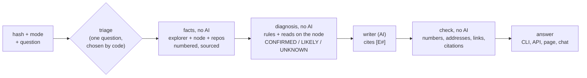

# AnyChain Transaction Assistant

Explains and troubleshoots a transaction on **any EVM network**, for a merchant ("why didn't my payment go through?"), a developer or an auditor. Every statement cites a numbered fact with its source (explorer, node, verified code, repository); the AI only writes from those facts, and a check rejects anything it adds. Switching networks means switching a YAML file.


---

## Start here (for a reviewer with an hour)

1. Watch the GIF above, then run the quickstart below (a few minutes).
2. Read [docs/ARCHITECTURE.md](docs/ARCHITECTURE.md) section 0 ("What this is, in one minute") and section 2 ("How the diagnosis decides").
3. Read the code in this order, each a few hundred lines at its core: `src/anychain/service.py` (one answer, end to end), `bundle.py` (`BundleBuilder.build`: how facts are collected), `diagnosis.py` (`diagnose` and the rules list), `validator.py` (the check on the AI's answer), `writer.py` (the prompts and the three model backends).
4. Skim the sample conversations (section 4) and the evaluation table (section 5).
5. For any choice that looks odd, search [docs/DECISIONS.md](docs/DECISIONS.md) for its number (D1 to D68): each says why, with the real transaction behind it.

---

## 1. Quickstart

Requires Python 3.11+ and [uv](https://docs.astral.sh/uv/). The written answer needs a model: the local [Claude Code](https://claude.com/claude-code) CLI (the default, logged in, no key), or an Anthropic or OpenAI API key, saved once with `anychain llm set` (or the page's **Model** panel) and kept outside the repository, readable by your user only. Without a model, everything still runs and shows the facts only.

```bash
cd anychain        # the repository's folder
uv sync

# choose the model (skip if Claude Code is installed and logged in); the key is asked for, not shown
uv run anychain llm set --provider anthropic            # or openai; then pick the model from the provider's list
uv run anychain llm test --config configs/ethereum-mainnet.yaml

# CLI: explain a transaction (a USDC transfer on Ethereum)
uv run anychain explain 0x7909bd56b9a3a0e932fa20ccd7093fcafcad133c51af652c921cd329b2307952 \
  --config configs/ethereum-mainnet.yaml

# the same code on another network, facts only (no model)
uv run anychain explain 0x7db4433fc318dfcf4a8d07022aec6135a5adb69b227f5a82e3092b3a648b0921 \
  --config configs/optimism-mainnet.yaml --no-llm

# a failure, with a question, as JSON
uv run anychain explain 0x73c4c0385483897a8c3cca6e4573c880dab32265bbacd94923fff2466cb45c8a \
  --config configs/ethereum-mainnet.yaml --mode developer --question "why did it fail?" --json

# API + web page on http://127.0.0.1:8000 (this machine only: the API has no authentication); see "The page" below
uv run anychain serve --config configs/ethereum-mainnet.yaml

# follow-up questions in the terminal, evaluation, usage metrics, tests (offline, real recordings)
uv run anychain chat 0x73c4c0385483897a8c3cca6e4573c880dab32265bbacd94923fff2466cb45c8a --config configs/ethereum-mainnet.yaml
uv run anychain eval
uv run anychain metrics --config configs/ethereum-mainnet.yaml
uv run pytest -q
```

With Docker (no secrets in the image; the port is published on the host's 127.0.0.1 only):

```bash
docker build -t anychain .
docker run --rm -p 127.0.0.1:8000:8000 anychain                                   # API + page, Ethereum
docker run --rm anychain anychain explain 0x7909bd56b9a3a0e932fa20ccd7093fcafcad133c51af652c921cd329b2307952 --no-llm
```

Do not run it with `--network host`: inside the container the API listens on 0.0.0.0, which with the host's network means every interface of the host. In a container the Claude Code CLI is not available: for a written answer set `llm.provider: anthropic` (or `openai`) in a mounted config and pass the key as an environment variable at run time.

**The page** (`anychain serve`, then http://127.0.0.1:8000) is a conversation, in three versions chosen on its first screen:

- **Merchant** (`#/lojista`): plain words, the answer at a glance (worked or not, value moved, the fee rounded, the date in the reader's time zone), what to do now; the proof slides in on demand.
- **Developer** (`#/desenvolvedor`) and **Auditor** (`#/auditor`): the facts and their sources always beside the thread; the auditor sees the security notes first. A "facts only, no AI" switch.

The reader writes as they like ("meu pagamento 0x… não passou"): a transaction hash or an address anywhere in the message starts an explanation, the rest of the message is the question; an address lists its transactions as buttons; the clarifying question, when there is one, comes as a message with buttons. Any other message is a follow-up on the same transaction, answered by the chat with tools (a read on the node, a function's code, another transaction), each result a new sourced fact. Every citation `[E#]` opens its fact. Each network's config offers real example transactions.

**Settings** (⚙): the **network** (any of `configs/`, switched without restarting), **add a network** (chain id, coin, Blockscout explorer, node; "Test the connection" checks that the node answers on that chain id; saved on this computer only, in `~/.config/anychain/networks/`, mode 0600, because a node's address can carry a key; it is never sent back to the page), the **model** (Anthropic, OpenAI or local Claude Code; the key is saved on this computer and never shown again; the model is picked from the provider's own list for that key) and the **language** of the answers and the page (pt-BR, en, es). The settings endpoints answer only requests from the page itself (a custom header and an Origin check).

**Interfaces:** `anychain explain <hash> [--mode support|developer|auditor] [--config path] [--json] [--evidence] [--question "…"] [--no-llm] [--fresh]`, `anychain chat`, `anychain batch <file>`, `anychain serve`, `anychain eval`, `anychain metrics`, `anychain log`, `anychain repos sync`, `anychain llm show|set|test|clear`. API: `POST /explain` (hash, mode, question?, clarified?), `POST /chat` (session_id), `POST /feedback`, `GET /health` (active network; explorer, node and model status), `GET/POST /settings/llm`, `POST /settings/llm/models` (the provider's list for a key) and `POST /settings/llm/test` (the model and its key; the key is never returned), `GET/POST /settings/network` (list and switch), `GET /settings/network/draft`, `POST /settings/network/check` and `POST /settings/network/save` (add a network), `GET/POST /settings/answers` (language).

---

## 2. Configuration, and retargeting to another network (e.g. CloudWalk)

Everything network-specific is in one YAML file (`configs/*.yaml`); there is no network value in the code (a test enforces it: no explorer or node host, chain id, symbol or address; the only fixed URLs are links to the source of a rule's meaning, such as Uniswap's and OpenZeppelin's code, D31). Eight configs ship: Ethereum, Optimism, Gnosis, Rootstock, Celo, zkSync Era, the private demo network, and the CloudWalk template.

```yaml
network:    { name, chain_id, native_symbol, native_decimals, chain_type }   # chain_type = the explorer's Blockscout CHAIN_TYPE
explorer:   { type: blockscout, base_url, api_path: /api/v2, tx_url_template, address_url_template, timeout_s }
rpc:        { url, timeout_s, supports_debug_trace }                         # read-only JSON-RPC
repos:      [ { url, ref, source_globs, artifact_globs } ]                    # contract sources and ABIs, pinned
abi_strategy: { order: [explorer, repo_artifacts, repo_source_signatures, signature_db] }
llm:        { provider: claude_code | anthropic | openai, model, max_tokens }  # `anychain llm set` overrides it
assistant:  { default_mode, language, max_clarifying_questions, time_budget_s }
storage:    { sqlite_path, cache_dir }
```

**Retargeting to CloudWalk, step by step** (`configs/cloudwalk.example.yaml` is the commented template):

1. Copy the template to `configs/cloudwalk.yaml`.
2. `network`: chain id **2009** (mainnet) or **2008** (testnet), native currency **CWN** (public in chainid.network); `chain_type` as the internal Blockscout runs it (AnyChain warns when the explorer's answers look like another type).
3. `explorer.base_url` and `rpc.url`: the internal addresses (the public explorer names do not answer from outside). Keep `?app=anychain` on the RPC URL: Stratus can reject unidentified clients.
4. `repos`: the BRLC contracts, pinned to a commit. The template, like `ethereum-mainnet.yaml` and `devnet.yaml`, points to `github.com/cloudwallk/brlc-token`, an **unofficial public copy** (the organization is not CloudWalk's; the official repository went offline in 2024); prefer the internal official one. The other five configs set no repository: their facts come from the explorer and the node.
5. `signature_db.enabled: false` if policy forbids sending selectors to a public service.
6. `uv run anychain repos sync --config configs/cloudwalk.yaml`, then `uv run anychain serve --config configs/cloudwalk.yaml`. `GET /health` confirms the explorer, the node (and that its chain id matches) and the model.

No code change is needed: the same steps took the tool from Ethereum to five other networks of five different types, and to a **private network built like CloudWalk's**: a local node and a self-hosted Blockscout with the BRLC token from the repository deployed behind a proxy, read with `configs/devnet.yaml` only ([devnet/README.md](devnet/README.md)). There the BRLC call was decoded from the repository's source, and the revert reasons the explorer did not give were recovered by replaying the call on the node.

---

## 3. Architecture



- **Collectors:** the explorer (Blockscout API v2) and the network's node (JSON-RPC) are read in parallel, each request bounded by a time budget; every failure becomes a **gap** with a cause and a "worth retrying" flag, never an error on screen. The node checks the explorer (status, receipt, gas); a network-type profile handles fees, L1 status and deposits per chain type.
- **Decoder and ABI cascade:** explorer ABI (proxies and EIP-7702 delegates followed) → repo artifacts (the address checked against the artifact's own list) → signatures from repo sources → a public signature database (candidates only, never facts) → raw data, declared.
- **Diagnosis:** finds where a failure began (an inner call's execution error first), reads the reason at the top, proves it with reads on the node at the parent block (balance, allowance, owner, roles, paused, decimals), and checks that the conclusion explains every failure signal; a signal left over lowers CONFIRMED to LIKELY. Next steps for a non-technical reader and for a developer.
- **Context facts:** the called function's verified code (numbered lines, the reason's line), heuristic security notes, the sender's timeline around a failure (retries, approvals, repeated failures), gas notes.
- **Writer and check:** one prompt per mode; the model receives only the facts and the gaps (no API or node addresses); every number, address, hash, link and citation in its answer must be in the evidence (a number may be rounded or cut to the precision written, "cerca de 0,00012 ETH" for a fee of 0.00011683874115936 ETH, but never changed; D28), else it retries once, else the answer is withheld and the facts are shown.
- **Chat with tools:** the model asks for data in JSON (read a contract's state, show a function's code or a repo file, look at another transaction); our code checks and runs the request and adds the result as a new sourced fact.
- **Storage:** SQLite event log (one row per answer: gaps by cause, label, ABI source, cache, mode, tokens, cost, feedback) and a cache by network and hash for final, complete transactions.

The full diagrams (pipeline, diagnosis, one `explain`, the chat, quality, code map, gap classification, metrics) are in [docs/ARCHITECTURE.md](docs/ARCHITECTURE.md); every decision, with the real case behind it, is in [docs/DECISIONS.md](docs/DECISIONS.md) (D1 to D68).

---

## 4. Sample conversations

Real transactions replayed from their recordings and answered by the model through the same path as `explain` and the API; generated by `scripts/sample_conversations.py`, not edited by hand (also in [docs/SAMPLES.md](docs/SAMPLES.md); here the answers' own headings are shown as bold lines). The answers are in Portuguese, the configs' `assistant.language` (the page can switch it). Under each answer, the sources of every fact it cites. No single recorded failure has both an `eth_call` read and a repository citation: the second sample shows the reads, the third and the last show repository sources (the last one a configured repository's permalink, on the private demo network).

### A successful ERC-20 transfer, support mode

Network `ethereum-mainnet`, transaction `0x7909bd56b9a3a0e932fa20ccd7093fcafcad133c51af652c921cd329b2307952`, mode `support`.

**Assistant:**

**O que aconteceu**

A transação deu certo. Ela foi concluída em 7 de outubro, às 15h47 UTC, e não falhou [E1]. Foi um envio de USDC, sem nenhum ETH enviado junto (a transação usou 40360 de um limite de 45758 unidades de taxa de rede) [E1].

**O dinheiro se moveu?**

Sim. Foram enviados 69.3484 USDC da carteira 0xCA62C34d54b445283121905F19193416212117c4 para a carteira 0x74AA5387681505c806FF1E972B12cdfd01406828 [E5].

**Taxa**

A taxa de rede paga foi de cerca de 0,000085 ETH (valor exato: 0.00008537619972948 ETH) [E2].

<details><summary>Sources of the facts it cites</summary>

- **E1** (overview): [Explorer page](https://eth.blockscout.com/tx/0x7909bd56b9a3a0e932fa20ccd7093fcafcad133c51af652c921cd329b2307952), [Explorer API: transaction](https://eth.blockscout.com/api/v2/transactions/0x7909bd56b9a3a0e932fa20ccd7093fcafcad133c51af652c921cd329b2307952)
- **E2** (fee): [Explorer API: transaction](https://eth.blockscout.com/api/v2/transactions/0x7909bd56b9a3a0e932fa20ccd7093fcafcad133c51af652c921cd329b2307952)
- **E5** (token_transfer): [Explorer API: token transfers](https://eth.blockscout.com/api/v2/transactions/0x7909bd56b9a3a0e932fa20ccd7093fcafcad133c51af652c921cd329b2307952/token-transfers)

</details>

### A failure diagnosed with reads on the node (eth_call), developer mode

Network `celo-mainnet`, transaction `0x9a8b0c69355a900965e9d3ddb4f4a7d2bb8822872d36e3ba03b55e4e7f419817`, mode `developer`.

**Assistant:**

**Resumo**

A transação falhou (reverted) no bloco 78962884, em 2026-10-01T14:07:22.000000Z [E1]. O remetente é 0x9695B8367fd1Bb4800667Ff5F35B0CF142F410A0 e o contrato chamado é 0x48065fbBE25f71C9282ddf5e1cD6D6A887483D5e (Tether USD) [E1]. O valor nativo anexado foi 0 CELO, não transferido porque a transação reverteu [E1]. Foram usados 33839 de gas de um limite de 100000 [E1].

**Taxa**

A taxa paga foi 0.008222877 CELO, cobrada mesmo com a falha da transação [E2].

**Chamada decodificada**

- Função: `transfer(address,uint256)` em 0x48065fbBE25f71C9282ddf5e1cD6D6A887483D5e (Tether USD) [E4].
- Argumento `recipient`: 0x14634De7D71618013Dc48F2e85E80A28023f4367 [E4].
- Argumento `amount`: 106500 [E4].
- Origem da ABI: o explorer, contrato verificado TransparentUpgradeableProxy (proxy) -> TetherTokenCeloExtension [E4].

**Movimentos**

Há uma chamada interna `delegatecall` de 0x48065fbBE25f71C9282ddf5e1cD6D6A887483D5e (Tether USD) para 0xBF83F8436Ac46A8B1da5A9348eD84F68aEe07B98 (TetherTokenCeloExtension), e essa chamada falhou: o explorer reporta "execution reverted" [E6]. Os fatos não trazem nenhuma transferência de token nem evento concluídos, então isso não é conhecido a partir deles [E6].

**Causa**

- CONFIRMED: no bloco 78962883, o anterior à transação, o saldo de 0x9695B8367fd1Bb4800667Ff5F35B0CF142F410A0 no token 0x48065fbBE25f71C9282ddf5e1cD6D6A887483D5e era 1445 unidades brutas (0.001445 USD₮), menor que as 106500 unidades brutas (0.1065 USD₮) pedidas na chamada [E10]. Os valores usam decimals() = 6 e symbol() = "USD₮", que é o nome que o contrato dá a si mesmo, não prova de qual token é [E10].
- O explorer reporta o motivo do revert: `Error(string reason)` com reason='ERC20: transfer amount exceeds balance' [E3].
- Essa mensagem está escrita no código-fonte verificado `@openzeppelin/contracts-upgradeable/token/ERC20/ERC20Upgradeable.sol`, linha 236 [E12].

**Código**

- `transfer(address recipient, uint256 amount)` (linhas 117-120) chama `_transfer(_msgSender(), recipient, amount);` e depois retorna `true` [E5]. Esse código vem da implementação que o explorer lista hoje e pode ter sido atualizada desde esta transação [E5].
- `_transfer` (linhas 225-245) exige que `sender` e `recipient` não sejam `address(0)` (linhas 230-231) [E11].
- Na linha 235 lê `_balances[sender]` e na linha 236 faz `require(senderBalance >= amount, "ERC20: transfer amount exceeds balance");` [E11].
- Depois subtrai `amount` do saldo do remetente (linha 238), soma ao saldo do destinatário (linha 240) e emite `Transfer` (linha 242) [E11].
- O fato diz que a falha foi, muito provavelmente, levantada na linha 236, a menos que tenha sido repassada de outra função ou contrato chamado [E11].

**Linha do tempo**

A mesma chamada `transfer` falhou pelo menos 35 vezes seguidas, sem outra transação do remetente no meio (nonces 54482 a 54516) [E14].

**Gas**

Nota heurística, não é um achado: foram usados 33839 do limite de 100000 (33.8%) [E15].

**Próximos passos**

Para um desenvolvedor:
- Verifique o saldo da conta de onde os tokens saem antes de enviar, e mova no máximo esse valor [E10].
- Se o saldo era esperado, procure uma transação anterior que o tenha gasto [E10].

**O que falta**

A linha do tempo está incompleta: o remetente enviou pelo menos 150 transações depois desta, e as imediatamente seguintes não aparecem. Para saber, é preciso abrir a página do remetente no explorer (não é possível tentar novamente automaticamente).

<details><summary>Sources of the facts it cites</summary>

- **E1** (overview): [Explorer page](https://celo.blockscout.com/tx/0x9a8b0c69355a900965e9d3ddb4f4a7d2bb8822872d36e3ba03b55e4e7f419817), [Explorer API: transaction](https://celo.blockscout.com/api/v2/transactions/0x9a8b0c69355a900965e9d3ddb4f4a7d2bb8822872d36e3ba03b55e4e7f419817)
- **E2** (fee): [Explorer API: transaction](https://celo.blockscout.com/api/v2/transactions/0x9a8b0c69355a900965e9d3ddb4f4a7d2bb8822872d36e3ba03b55e4e7f419817)
- **E3** (revert): [Explorer API: transaction](https://celo.blockscout.com/api/v2/transactions/0x9a8b0c69355a900965e9d3ddb4f4a7d2bb8822872d36e3ba03b55e4e7f419817)
- **E4** (call): [Explorer API: transaction](https://celo.blockscout.com/api/v2/transactions/0x9a8b0c69355a900965e9d3ddb4f4a7d2bb8822872d36e3ba03b55e4e7f419817), [Explorer API: contract ABI](https://celo.blockscout.com/api/v2/smart-contracts/0x48065fbBE25f71C9282ddf5e1cD6D6A887483D5e)
- **E5** (code): [Explorer API: verified source](https://celo.blockscout.com/api/v2/smart-contracts/0xBF83F8436Ac46A8B1da5A9348eD84F68aEe07B98)
- **E6** (internal_call): [Explorer API: internal transactions](https://celo.blockscout.com/api/v2/transactions/0x9a8b0c69355a900965e9d3ddb4f4a7d2bb8822872d36e3ba03b55e4e7f419817/internal-transactions)
- **E10** (diagnosis): [Explorer API: transaction](https://celo.blockscout.com/api/v2/transactions/0x9a8b0c69355a900965e9d3ddb4f4a7d2bb8822872d36e3ba03b55e4e7f419817), [JSON-RPC](https://forno.celo.org), [JSON-RPC](https://forno.celo.org), [JSON-RPC](https://forno.celo.org)
- **E11** (code): [Explorer API: verified source](https://celo.blockscout.com/api/v2/smart-contracts/0xBF83F8436Ac46A8B1da5A9348eD84F68aEe07B98)
- **E12** (source): [Explorer API: verified source](https://celo.blockscout.com/api/v2/smart-contracts/0xBF83F8436Ac46A8B1da5A9348eD84F68aEe07B98)
- **E14** (timeline): [Explorer API: the sender's transactions](https://celo.blockscout.com/api/v2/addresses/0x9695B8367fd1Bb4800667Ff5F35B0CF142F410A0/transactions?filter=from)
- **E15** (gas_note): [Explorer API: transaction](https://celo.blockscout.com/api/v2/transactions/0x9a8b0c69355a900965e9d3ddb4f4a7d2bb8822872d36e3ba03b55e4e7f419817)

</details>

**Missing data the answer declares:**

- Timeline: the sender sent at least 150 transactions after this one; those right after it are not shown

### A failure diagnosed from the contract's verified code and the rule's repository source, with the sender's timeline, developer mode

Network `ethereum-mainnet`, transaction `0x73c4c0385483897a8c3cca6e4573c880dab32265bbacd94923fff2466cb45c8a`, mode `developer`.

**Assistant:**

**Resumo**

A transação falhou (reverteu) no bloco 26149091, enviada de 0x79D6C25dE86bC4A858d7e383A474667aB109FeD0 para 0x7a250d5630B4cF539739dF2C5dAcb4c659F2488D (UniswapV2Router02); os 0.045 ETH anexados não foram transferidos [E1]. O recibo obtido por RPC confirma, de forma independente, o status de falha [E8].

**Taxa**

A taxa paga foi de 0.00011683874115936 ETH, cobrada mesmo com a falha [E2].

**Chamada decodificada**

- Função: `swapExactETHForTokens(uint256,address[],address,uint256)` no contrato 0x7a250d5630B4cF539739dF2C5dAcb4c659F2488D (UniswapV2Router02) [E4].
- `amountOutMin` = 0 [E4].
- `path` = [0xC02aaA39b223FE8D0A0e5C4F27eAD9083C756Cc2, 0xA0b86991c6218b36c1d19D4a2e9Eb0cE3606eB48] [E4].
- `to` = 0x79D6C25dE86bC4A858d7e383A474667aB109FeD0 [E4].
- `deadline` = 2400 [E4].
- Origem do ABI: explorer, contrato verificado UniswapV2Router02 [E4].

**Causa**

- CONFIRMED: o parâmetro `deadline` da chamada é 2400 (1970-01-01T00:40:00Z) e o horário do bloco é 1791479507 (2026-10-08T17:11:47Z); o prazo já havia passado quando a transação foi incluída, e a razão 'UniswapV2Router: EXPIRED' é a verificação de prazo da Uniswap [E6].
- O explorer reporta o motivo do revert: Error(string reason) com reason='UniswapV2Router: EXPIRED' [E3].
- A razão 'UniswapV2Router: EXPIRED' está escrita no código-fonte verificado, em contracts/UniswapV2Router02.sol, linha 19 [E7].

**Código**

Nas linhas mostradas (contracts/UniswapV2Router02.sol, linhas 252-266), a função é `external`, `payable` e usa o modificador `ensure(deadline)` [E5]. Ela exige que `path[0] == WETH`, senão reverte com 'UniswapV2Router: INVALID_PATH' [E5]. Depois calcula `amounts` com `UniswapV2Library.getAmountsOut(factory, msg.value, path)` [E5]. Exige que o último valor de `amounts` seja `>= amountOutMin`, senão reverte com 'UniswapV2Router: INSUFFICIENT_OUTPUT_AMOUNT' [E5]. Em seguida chama `IWETH(WETH).deposit` com `amounts[0]`, transfere o WETH ao par com `assert` e executa `_swap(amounts, path, to)` [E5].

**Linha do tempo**

A mesma chamada (`swapExactETHForTokens` para 0x7a250d5630B4cF539739dF2C5dAcb4c659F2488D) teve sucesso 48 segundos depois (nonce 53), a primeira vez que deu certo após esta falha [E10].

**Gás**

Notas heurísticas, não são conclusões: foram usados 25320 de um limite de 300000 (8.4%); a mesma chamada teve sucesso no nonce 53 usando 119837 de gás, com limite de 300000, e esta transação também tinha limite de 300000 [E11].

**Próximos passos**

Para um desenvolvedor: verificar o preço atual e reenviar com um novo `deadline` (e uma taxa alta o suficiente para ser incluída a tempo) [E6].

<details><summary>Sources of the facts it cites</summary>

- **E1** (overview): [Explorer page](https://eth.blockscout.com/tx/0x73c4c0385483897a8c3cca6e4573c880dab32265bbacd94923fff2466cb45c8a), [Explorer API: transaction](https://eth.blockscout.com/api/v2/transactions/0x73c4c0385483897a8c3cca6e4573c880dab32265bbacd94923fff2466cb45c8a)
- **E2** (fee): [Explorer API: transaction](https://eth.blockscout.com/api/v2/transactions/0x73c4c0385483897a8c3cca6e4573c880dab32265bbacd94923fff2466cb45c8a)
- **E3** (revert): [Explorer API: transaction](https://eth.blockscout.com/api/v2/transactions/0x73c4c0385483897a8c3cca6e4573c880dab32265bbacd94923fff2466cb45c8a)
- **E4** (call): [Explorer API: transaction](https://eth.blockscout.com/api/v2/transactions/0x73c4c0385483897a8c3cca6e4573c880dab32265bbacd94923fff2466cb45c8a), [Explorer API: contract ABI](https://eth.blockscout.com/api/v2/smart-contracts/0x7a250d5630B4cF539739dF2C5dAcb4c659F2488D)
- **E5** (code): [Explorer API: verified source](https://eth.blockscout.com/api/v2/smart-contracts/0x7a250d5630B4cF539739dF2C5dAcb4c659F2488D)
- **E6** (diagnosis): [Explorer API: transaction](https://eth.blockscout.com/api/v2/transactions/0x73c4c0385483897a8c3cca6e4573c880dab32265bbacd94923fff2466cb45c8a), [Source of the rule's meaning](https://github.com/Uniswap/v2-periphery/blob/ed24991304291297c3b4a52818d02f46a17aa9a2/contracts/UniswapV2Router02.sol#L19)
- **E7** (source): [Explorer API: verified source](https://eth.blockscout.com/api/v2/smart-contracts/0x7a250d5630B4cF539739dF2C5dAcb4c659F2488D)
- **E8** (cross_check): [JSON-RPC](https://ethereum-rpc.publicnode.com), [Explorer API: transaction](https://eth.blockscout.com/api/v2/transactions/0x73c4c0385483897a8c3cca6e4573c880dab32265bbacd94923fff2466cb45c8a)
- **E10** (timeline): [Explorer API: the sender's transactions](https://eth.blockscout.com/api/v2/addresses/0x79D6C25dE86bC4A858d7e383A474667aB109FeD0/transactions?filter=from)
- **E11** (gas_note): [Explorer API: transaction](https://eth.blockscout.com/api/v2/transactions/0x73c4c0385483897a8c3cca6e4573c880dab32265bbacd94923fff2466cb45c8a), [Explorer API: the sender's transactions](https://eth.blockscout.com/api/v2/addresses/0x79D6C25dE86bC4A858d7e383A474667aB109FeD0/transactions?filter=from)

</details>

### A contract the explorer has not verified (degradation), with a clarifying question (triage)

Network `ethereum-mainnet`, transaction `0x68098e2a69deadd1f60396d667781517a5cfdf257a5e35f79f0c47c52f5f51c9`, mode `support`.

**Assistant asks:** What were you trying to do? The failure's words are those of a swap's minimum-output (slippage) check, but this contract's own code decides what they mean here.

- Swap or trade tokens
- Something else

**Reader answers:** Something else

**Assistant:**

**O que aconteceu**

A operação falhou e não foi concluída [E1]. A rede confirmou isso por duas fontes [E18]. A causa não dá para saber (UNKNOWN). Existe só uma possibilidade: a mensagem de erro usa palavras de uma trava de preço de troca, em que o resultado seria menor que o mínimo definido. Mas o código do serviço é que decide o que ela significa de fato, e ele não aparece nas informações [E17]. (Erro original: 'INSUFFICIENT_OUTPUT_AMOUNT'; a falha ocorreu no serviço 0x278d858f05b94576C1E6f73285886876ff6eF8D2, em 7 de outubro, às 15h51 UTC [E1].)

**O que você nos disse**

Você disse que não estava trocando nem negociando moedas. Isso não combina bem com a possibilidade acima, que fala de uma troca. O significado real do erro depende do código desse serviço, que não temos [E23].

**O dinheiro saiu?**

Não. O valor anexado era 0 ETH, e nada foi transferido porque a operação falhou [E1].

**Taxa**

Foi cobrada uma taxa de rede de cerca de 0,00029 ETH (0.000294067451118215 ETH), mesmo com a falha [E2].

**O que aconteceu depois**

A mesma operação, feita pelo mesmo remetente, deu certo 372 segundos depois, na tentativa seguinte [E20]. Antes disso, ela havia falhado 2 vezes seguidas, sem outra operação no meio [E21].

**O que fazer**

Não há nada a refazer: a mesma operação já deu certo depois. Você pode conferir essa tentativa posterior que funcionou [E20].

**O que está faltando**

Não dá para saber o que a operação pedia exatamente, porque não há informação que explique o que essa chamada faz. Seria preciso o serviço estar verificado no explorador, ou ter a descrição técnica dele [E4]. Também não consegui consultar o banco de nomes de funções. Isso pode ser tentado de novo em alguns minutos [E4].

<details><summary>Sources of the facts it cites</summary>

- **E1** (overview): [Explorer page](https://eth.blockscout.com/tx/0x68098e2a69deadd1f60396d667781517a5cfdf257a5e35f79f0c47c52f5f51c9), [Explorer API: transaction](https://eth.blockscout.com/api/v2/transactions/0x68098e2a69deadd1f60396d667781517a5cfdf257a5e35f79f0c47c52f5f51c9)
- **E2** (fee): [Explorer API: transaction](https://eth.blockscout.com/api/v2/transactions/0x68098e2a69deadd1f60396d667781517a5cfdf257a5e35f79f0c47c52f5f51c9)
- **E4** (call): [Explorer API: transaction](https://eth.blockscout.com/api/v2/transactions/0x68098e2a69deadd1f60396d667781517a5cfdf257a5e35f79f0c47c52f5f51c9)
- **E6** (internal_call): [Explorer API: internal transactions](https://eth.blockscout.com/api/v2/transactions/0x68098e2a69deadd1f60396d667781517a5cfdf257a5e35f79f0c47c52f5f51c9/internal-transactions)
- **E17** (diagnosis): [Explorer API: transaction](https://eth.blockscout.com/api/v2/transactions/0x68098e2a69deadd1f60396d667781517a5cfdf257a5e35f79f0c47c52f5f51c9), [Source of the rule's meaning](https://github.com/Uniswap/v2-periphery/blob/ed24991304291297c3b4a52818d02f46a17aa9a2/contracts/UniswapV2Router02.sol#L232)
- **E18** (cross_check): [JSON-RPC](https://ethereum-rpc.publicnode.com), [Explorer API: transaction](https://eth.blockscout.com/api/v2/transactions/0x68098e2a69deadd1f60396d667781517a5cfdf257a5e35f79f0c47c52f5f51c9)
- **E20** (timeline): [Explorer API: the sender's transactions](https://eth.blockscout.com/api/v2/addresses/0xd05E8724aD399Bb618497b1bf66a4A24Ab156351/transactions?filter=from)
- **E21** (timeline): [Explorer API: the sender's transactions](https://eth.blockscout.com/api/v2/addresses/0xd05E8724aD399Bb618497b1bf66a4A24Ab156351/transactions?filter=from)
- **E23** (triage): The reader's answer to the clarifying question

</details>

**Missing data the answer declares:**

- Call decoding: no ABI for 0x278d858f05b94576C1E6f73285886876ff6eF8D2 matches selector 0x70521ae9
- Signature database: the recording has no answer from this source, so the replay treats it as unavailable

### Triage: it succeeded, but the reader says the payment did not arrive

Network `ethereum-mainnet`, transaction `0x7909bd56b9a3a0e932fa20ccd7093fcafcad133c51af652c921cd329b2307952`, mode `support`.

**Reader:** não recebi o pagamento

**Assistant asks:** Which payment did you expect? Pick the one below, or type the address that should have received it.

- Token transfer: 69.3484 USDC from 0xCA62C34d54b445283121905F19193416212117c4 to 0x74AA5387681505c806FF1E972B12cdfd01406828.

**Reader answers:** 0x000000000000000000000000000000000000dEaD

**Assistant:**

**O que aconteceu**

A transação deu certo. Ela foi concluída em 7 de outubro, às 15h47 UTC, e não houve nenhum valor em ETH enviado nela [E1]. Era uma transferência de USDC [E1].

**O que você nos disse**

Você disse que esperava um pagamento para o endereço 0x000000000000000000000000000000000000dEaD [E9]. Isso é só uma possibilidade, não algo confirmado. Nenhuma das movimentações de valor que o explorador mostra para esta transação foi para esse endereço [E9]. O dinheiro foi para o endereço 0x74AA5387681505c806FF1E972B12cdfd01406828 [E9]. Um limite dessa comparação: moedas que o explorador esconde, como as que ele marca como golpe, não aparecem na lista [E9].

**O dinheiro se movimentou?**

Sim. Foram 69.3484 USDC, enviados do endereço 0xCA62C34d54b445283121905F19193416212117c4 para o endereço 0x74AA5387681505c806FF1E972B12cdfd01406828 [E5].

**Taxa**

A taxa de rede paga foi de cerca de 0,000085 ETH (0.00008537619972948 ETH) [E2].

<details><summary>Sources of the facts it cites</summary>

- **E1** (overview): [Explorer page](https://eth.blockscout.com/tx/0x7909bd56b9a3a0e932fa20ccd7093fcafcad133c51af652c921cd329b2307952), [Explorer API: transaction](https://eth.blockscout.com/api/v2/transactions/0x7909bd56b9a3a0e932fa20ccd7093fcafcad133c51af652c921cd329b2307952)
- **E2** (fee): [Explorer API: transaction](https://eth.blockscout.com/api/v2/transactions/0x7909bd56b9a3a0e932fa20ccd7093fcafcad133c51af652c921cd329b2307952)
- **E5** (token_transfer): [Explorer API: token transfers](https://eth.blockscout.com/api/v2/transactions/0x7909bd56b9a3a0e932fa20ccd7093fcafcad133c51af652c921cd329b2307952/token-transfers)
- **E9** (triage): The reader's answer to the clarifying question, [Explorer API: token transfers](https://eth.blockscout.com/api/v2/transactions/0x7909bd56b9a3a0e932fa20ccd7093fcafcad133c51af652c921cd329b2307952/token-transfers)

</details>

### The private demo network: a BRLC call decoded from the configured repository, and the cause the explorer did not give recovered by replaying the call on the node, developer mode

Network `anychain-devnet`, transaction `0x42864ecb1fdcb0f155cfb0d9c085452fdcfa21170cdf44c7f62bfafb5aed027f`, mode `developer`.

**Assistant:**

**Resumo**
- A transação falhou (reverted) no bloco 63, em 2026-10-09T01:41:02.000000Z [E1].
- O remetente é 0x3C44CdDdB6a900fa2b585dd299e03d12FA4293BC e o contrato chamado é 0xe7f1725E7734CE288F8367e1Bb143E90bb3F0512 (BRL Coin) [E1].
- O recibo obtido por RPC confirma, de forma independente, o status failed [E7].
- O mesmo remetente tem outra transação para o mesmo contrato (nonce 0), que também aparece como failed. Esta transação é o nonce 1 [E8].

**Taxa**
- A taxa paga foi 0.000000007752902729 ETH, cobrada mesmo com a falha [E2].

**Chamada decodificada**
- A função chamada foi `setPauser(address)` no contrato 0xe7f1725E7734CE288F8367e1Bb143E90bb3F0512 (BRL Coin) [E3].
- O argumento `newPauser` é 0x3C44CDDdb6A900fA2b585D8C4E1a7C9ee5f0f9C3 [E3].
- O ABI vem do repositório cloudwallk/brlc-token@74a5498 (BRLCToken), fixado a esse endereço na configuração [E3].

**Causa**
- UNKNOWN: não há motivo disponível para a falha da transação original. Falta um nó que consiga rastrear a transação [E4].
- LIKELY: a causa provável vem de um replay (reexecução) no bloco 62. O replay reverteu com a razão 'Ownable: caller is not the owner', uma verificação de acesso que recusa o chamador [E6].
- Se a transação original falhou do mesmo modo, essa é a causa. Isso não está confirmado [E6].
- O replay usa o estado e o contexto do bloco anterior, sem as transações que vieram antes dela no próprio bloco. Por isso pode diferir do que ocorreu na transação original [E5].
- Nenhum fato indica uma linha de código como origem da reversão, então não cito nenhuma [E4].

**Gás**
- Heurística, não um achado: foram usados 28963 de um limite de 200000 (14.5%) [E9].

**Próximos passos**
- Para um desenvolvedor: use um nó com suporte a trace para descobrir onde a transação reverteu, ou pergunte aos desenvolvedores do contrato [E4].
- Para um desenvolvedor: reenviar a mesma chamada sem alterações provavelmente falha do mesmo jeito e cobra a taxa de novo, pois a recusa vem de uma verificação de permissão [E6].
- Para um desenvolvedor: descubra qual conta a verificação recusou e se ela deveria ter a permissão. Se deveria, peça aos operadores do contrato que a concedam [E6].

**O que falta**
- Motivo da reversão: o explorer não informou por que a transação falhou. É preciso um nó que reexecute ou rastreie a chamada (debug/trace RPC). Não é recuperável por nova tentativa [E4].
- Chamadas internas: o explorer ainda está indexando as chamadas internas desta transação. Consulte novamente em alguns minutos [E8].

<details><summary>Sources of the facts it cites</summary>

- **E1** (overview): [Explorer page](http://127.0.0.1:14000/tx/0x42864ecb1fdcb0f155cfb0d9c085452fdcfa21170cdf44c7f62bfafb5aed027f), [Explorer API: transaction](http://127.0.0.1:14000/api/v2/transactions/0x42864ecb1fdcb0f155cfb0d9c085452fdcfa21170cdf44c7f62bfafb5aed027f)
- **E2** (fee): [Explorer API: transaction](http://127.0.0.1:14000/api/v2/transactions/0x42864ecb1fdcb0f155cfb0d9c085452fdcfa21170cdf44c7f62bfafb5aed027f)
- **E3** (call): [Explorer API: transaction](http://127.0.0.1:14000/api/v2/transactions/0x42864ecb1fdcb0f155cfb0d9c085452fdcfa21170cdf44c7f62bfafb5aed027f), [Repository cloudwallk/brlc-token@74a5498](https://github.com/cloudwallk/brlc-token/blob/74a5498d04b10dc882e48273a38b98b4275463bd/contracts/BRLCToken.sol#L12-L60)
- **E4** (diagnosis): [Explorer API: transaction](http://127.0.0.1:14000/api/v2/transactions/0x42864ecb1fdcb0f155cfb0d9c085452fdcfa21170cdf44c7f62bfafb5aed027f)
- **E5** (replay): [JSON-RPC](http://127.0.0.1:18545)
- **E6** (diagnosis): [JSON-RPC](http://127.0.0.1:18545), [Source of the rule's meaning](https://github.com/OpenZeppelin/openzeppelin-contracts/blob/dc44c9f1a4c3b10af99492eed84f83ed244203f6/contracts/access/Ownable.sol#L51)
- **E7** (cross_check): [JSON-RPC](http://127.0.0.1:18545), [Explorer API: transaction](http://127.0.0.1:14000/api/v2/transactions/0x42864ecb1fdcb0f155cfb0d9c085452fdcfa21170cdf44c7f62bfafb5aed027f)
- **E8** (timeline): [Explorer API: the sender's transactions](http://127.0.0.1:14000/api/v2/addresses/0x3C44CdDdB6a900fa2b585dd299e03d12FA4293BC/transactions?filter=from)
- **E9** (gas_note): [Explorer API: transaction](http://127.0.0.1:14000/api/v2/transactions/0x42864ecb1fdcb0f155cfb0d9c085452fdcfa21170cdf44c7f62bfafb5aed027f)

</details>

**Missing data the answer declares:**

- Revert reason: the explorer did not report why the transaction failed
- Internal calls: the explorer is still indexing this transaction's internal calls

---

## 5. Evaluation results

`anychain eval` replays 11 real transactions from their recordings (8 on Ethereum, 2 on Optimism, 1 on the private demo network; `eval/cases.yaml`) through the whole pipeline, the model included, and measures the answer. Latest run ([eval/report.md](eval/report.md), per-case details in `eval/report.json`):

Run 2026-10-09 10:10, commit 9a151ac, model claude-sonnet-5-5. Every case is a real transaction replayed from its recording (eval/cases.yaml).

| Metric | Result |
|---|---|
| Status accuracy | 100.0% |
| Diagnosis rule and label accuracy | 100.0% |
| ABI source accuracy | 100.0% |
| Degradation declared correctly | 100.0% |
| Citation coverage (factual sentences citing a fact) | 78.1% |
| First drafts the check caught (a value or citation not in the evidence; rewritten) | 0.0% |
| Key values present in the answer | 100.0% |
| Key facts cited (each conclusion, and what the sender's timeline shows) | 100.0% |
| Delivered answers with a value not in the evidence | 0 (every answer shown passed the check) |
| Values the check caught on a first attempt | 0 |
| Answers withheld | 0 of 11 |
| Time per written answer | 9.6 s |
| Tokens sent (cache included) / received | 58239 / 10632 (12981 read from the cache) |
| Cost reported by the backend | 0.2899 USD |

| Case | Network | Status | Rule / label | ABI | Gaps | Answer | Cited | Values | Key facts | Seconds | Tokens in/out |
|---|---|---|---|---|---|---|---|---|---|---|---|
| erc20_transfer | ethereum-mainnet | ok success | ok -  | ok explorer |  - | ok | 4/4 | 2/2 | 0/0 | 4.4 | 3875/251 |
| dex_swap | ethereum-mainnet | ok success | ok -  | ok explorer |  - | ok | 22/22 | 2/2 | 0/0 | 14.0 | 5224/1866 |
| explicit_reason | ethereum-mainnet | ok failed | ok deadline CONFIRMED | ok explorer |  - | ok | 16/18 | 2/2 | 2/2 | 12.8 | 4814/1386 |
| inner_out_of_gas | ethereum-mainnet | ok failed | ok out_of_gas LIKELY | ok explorer |  - | ok | 9/11 | 2/2 | 2/2 | 6.9 | 6523/577 |
| out_of_gas | ethereum-mainnet | ok failed | ok out_of_gas CONFIRMED | ok explorer |  not_interpretable | ok | 7/11 | 1/1 | 2/2 | 6.0 | 4680/528 |
| unverified_contract | ethereum-mainnet | ok failed | ok slippage LIKELY | ok raw |  not_interpretable, source_unavailable | ok | 28/35 | 1/1 | 3/3 | 13.3 | 6386/1904 |
| custom_error | ethereum-mainnet | ok failed | ok contract_reason CONFIRMED | ok raw |  not_interpretable | ok | 23/33 | 1/1 | 2/2 | 17.4 | 9624/2051 |
| node_unavailable | ethereum-mainnet | ok success | ok -  | ok explorer | ok source_unavailable | ok | 5/8 | 1/1 | 0/0 | 5.6 | 3821/342 |
| second_network_transfer | optimism-mainnet | ok success | ok -  | ok explorer |  - | ok | 4/4 | 2/2 | 0/0 | 4.7 | 3941/290 |
| second_network_failure | optimism-mainnet | ok failed | ok deadline LIKELY | ok signature_db |  not_interpretable | ok | 9/13 | 1/1 | 2/2 | 11.9 | 4839/658 |
| allowance_devnet | anychain-devnet | ok failed | ok no_reason UNKNOWN (replay: insufficient_allowance) | ok raw | ok not_interpretable, source_behind | ok | 16/24 | 1/1 | 2/2 | 8.4 | 4512/779 |

Citation coverage varies between runs of the same commit and prompts: 78.1% and 84.0% in the two runs of 2026-10-09 with the final prompts (the model writes differently each time); the other metrics did not move.

The allowance category had no real case on a public network (the candidate found was an inner out-of-gas, D50, D51); its real case comes from the private demo network, where the explorer gives no reason and the replay on the node finds "insufficient allowance" (D60). "First drafts the check caught" counts answers the model had to rewrite because they stated a value or cited a fact not in the evidence: none in this run. Earlier runs showed one ("E624"), which turned out to be the check's mistake, not the model's: a shortened address ("0x52b2…E624") read as a citation; fixed (D62).

**Smaller models:** the same eval with gpt-4.1-nano (OpenAI's smallest model), on the same commit and prompts (`eval/runs/nano-final-d67`): the same diagnosis, 100% of the key values and key facts, no answer withheld, 80.3% of factual sentences citing a fact. Getting there took code, not a longer prompt: an outline built for each transaction from its facts, only the reader's own next steps, citations normalized, and the key facts enforced (D62, with each step measured). The merchant's plain language (D67) lets more jargon through with the small model than with a larger one.

**Acceptance against an independent source:** 1,800 randomly sampled transactions (300 on each of six networks), checked against the network's node: six checks each (status, value, fee, token transfers, no double-counted native value, addresses exist) plus the L1 status on zkSync, 11,100 checks in all: 11,008 passed, 88 had no node data to compare, 4 flagged. The 3 false facts found (a missing receipt called "pending", a blob fee left out on Gnosis) were fixed with tests on the recorded cases; the fourth is a token the explorer hides as scam ([docs/acceptance-report.md](docs/acceptance-report.md)). The run used the Phase 3 code: the Phase 4 facts (timeline, gas notes, triage) come from the same explorer lists and are covered by tests on recordings, not by this run.

---

## 6. Metrics and measuring impact in production

`anychain metrics` prints usage numbers from the local event log (`data/runs.db`, one row per answer given from the CLI or the API; it fills as the tool is used, so a fresh clone shows empty tables), each with the SQL that computes it (all five below; the same text is in `src/anychain/metrics.py`):

```sql
-- Failure causes (the diagnosis rule of each failed transaction)
SELECT COALESCE(rule, 'no conclusion') AS cause, COUNT(*) AS answers,
       COUNT(DISTINCT network || tx_hash) AS transactions, 100.0 * COUNT(*) / SUM(COUNT(*)) OVER () AS share
FROM runs
WHERE ts >= :since AND source IN ('cli', 'api') AND mode IS NOT NULL AND status = 'failed'
GROUP BY cause ORDER BY answers DESC;

-- Diagnosis labels (CONFIRMED / LIKELY / UNKNOWN)
SELECT COALESCE(diagnosis, 'unlabelled') AS label, COUNT(*) AS answers,
       COUNT(DISTINCT network || tx_hash) AS transactions, 100.0 * COUNT(*) / SUM(COUNT(*)) OVER () AS share
FROM runs
WHERE ts >= :since AND source IN ('cli', 'api') AND mode IS NOT NULL AND status = 'failed'
GROUP BY label ORDER BY answers DESC;

-- ABI source of the main call (explorer / repo / signature-database candidates / raw)
SELECT abi_source, COUNT(*) AS answers, COUNT(DISTINCT network || tx_hash) AS transactions,
       100.0 * COUNT(*) / SUM(COUNT(*)) OVER () AS share
FROM runs
WHERE ts >= :since AND source IN ('cli', 'api') AND mode IS NOT NULL AND abi_source IS NOT NULL
GROUP BY abi_source ORDER BY answers DESC;

-- Cache (answers served without asking the explorer and the node)
SELECT CASE WHEN cache = 'hit' THEN 'hit' WHEN cache = 'stored' THEN 'stored'
            WHEN cache LIKE 'not kept%' THEN 'not kept' ELSE COALESCE(cache, 'unknown') END AS cache,
       COUNT(*) AS answers, 100.0 * COUNT(*) / SUM(COUNT(*)) OVER () AS share
FROM runs
WHERE ts >= :since AND source IN ('cli', 'api') AND mode IS NOT NULL
GROUP BY 1 ORDER BY answers DESC;

-- Satisfaction by mode (thumbs up and down from the page)
SELECT mode, COALESCE(SUM(feedback = 'up'), 0) AS up, COALESCE(SUM(feedback = 'down'), 0) AS down,
       100.0 * SUM(feedback = 'up') / NULLIF(SUM(feedback IS NOT NULL), 0) AS satisfaction
FROM runs
WHERE ts >= :since AND source IN ('cli', 'api') AND mode IS NOT NULL
GROUP BY mode ORDER BY mode;
```

### Measuring impact in production (summary of [docs/IMPACT.md](docs/IMPACT.md))

- **Where:** in the support tool, next to a ticket that carries a transaction; the support agent reads the answer first and decides what to send; escalation hands engineering the developer view of the same evidence.
- **Hypothesis:** for transaction tickets, support resolves more without escalating to engineering, faster, without more wrong answers sent. Target to test: a 30% relative drop in escalations (an assumption, measured against a baseline).
- **Primary metrics:** resolution without escalation; time from ticket open to the first message stating the cause. **Guard metrics:** answers corrected by humans (edited cause, 👎, ticket reopened), reported hallucinations (target zero, each one becomes a test), answers withheld or without a model. **Health:** gaps by cause per network, cost, latency and cache per answer.
- **Experiment:** two weeks in shadow (answers recorded, never shown) for the baseline and the guards, then randomized by ticket at 10%, 25%, 50%, 100%, each stage until the primary metric's interval is clear.
- **Scale or roll back:** next stage when escalations drop and every guard holds; roll back on any confirmed hallucination sent to a customer, corrections above the control's rate, or more than 10% withheld or unavailable answers in a day. A rollback is a flag: recording continues.

---

## 7. Known limits and next steps

- **Public infrastructure:** public nodes keep the state of about the last 128 blocks, so reads at the parent block of an older failure are refused (said as a gap); one public node returns some old transactions without a receipt (the outcome is then "unknown", D53). An archive node removes both.
- **No trace yet:** where the explorer's internal calls do not show the failing frame, `debug_traceTransaction` would. The config records whether a node serves it (`rpc.supports_debug_trace`; Stratus does), but the tool does not call it yet: failures are explained from the explorer, reads on the node and a replay.
- **Explorer-hidden tokens:** a token the explorer marks as scam has its transfers hidden; the tool does not say so yet (backlog C1).
- **Heuristics stay heuristics:** security and gas notes are pattern matches on the shown code, never an audit.
- **Private demo network:** built and recorded (devnet/), but on a home server and rebuilt by hand; a CI job that brings it up, sends the transactions and runs `anychain eval` against it would keep the retargeting proof current. Calls inherited from OpenZeppelin are not decoded there, because the library is not in the configured repository: adding its source as a second repository would decode them.
- **Backlog:** imprecise wordings found by reviews and acceptance runs (level C), each with the real transaction it came from, in docs/ROADMAP.md.

---

## 8. How AI was used to build this

The code, tests and documents were written with Claude Code, in phases (Phase 1 from the plan in the case itself; Phases 2, 2.5, 3 and 4 each from a written spec approved before any code, in `docs/specs/`). The human decisions, recorded in `docs/DECISIONS.md` with dates, were mine: the scope and the order of the phases; the acceptance criterion (zero false facts of level A or B on 300 sampled transactions per network, checked against the node); which imprecise wordings to fix now and which to keep for later; running the writer on Claude Code instead of an API key; the retargeting target (CloudWalk) and its sources; and, after the evaluation found a rule that ignored an inner out-of-gas, asking for the diagnosis to start from the failure's origin. The process the model followed: a failing test before each fix, written from a real recorded transaction (nothing in the tests is invented); a review by a separate agent with a clean context before commits; and an independent acceptance run against the network's own node at the end of each phase.
