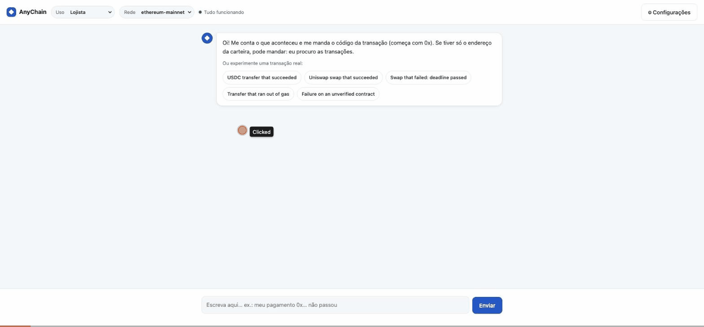
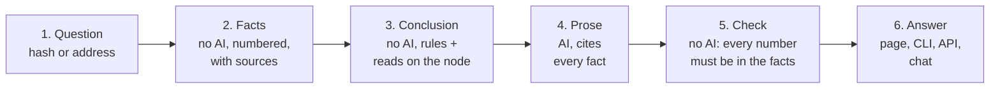

# AnyChain Transaction Assistant

An assistant that **explains a blockchain transaction** to someone non-technical (a merchant: "why didn't my payment go through?") and to someone technical (a developer, an auditor), on **any EVM network**, by changing only a configuration file.



## In one minute

The idea behind everything: **the AI finds nothing out; it only writes.** The code finds things out, and code can be tested.



Labels: **CONFIRMED** (proved), **LIKELY** (the best reading of the facts), **UNKNOWN** (not enough data, said why). A check failure means one retry, then the answer is withheld and the facts are shown.

- **If the AI makes a mistake, the check catches it.** A number that is not in the facts never reaches the reader.
- **If a rule makes a mistake, a test finds it.** The evaluation found a rule that ignored an inner call running out of gas; the rule was fixed and the real case became a test.
- **When data is missing, the answer says what is missing** ("the explorer did not answer; try again") instead of guessing.
- **Another network is another YAML file:** configs for seven networks ship (plus a CloudWalk template), among them a private one built like CloudWalk's.

| Who | What they get |
|---|---|
| Merchant | plain words: did it work, did the money move, the fee, what to do now; the proof on demand |
| Developer | the decoded call, the function's code, reads on the node, the sender's timeline, gas notes; every fact with its source |
| Auditor | security notes first (heuristics, never an audit), who may call the function, what could not be checked |

Interfaces: a **web page** (a conversation), a **CLI** (`explain`, `chat`, `batch`, `eval`, `metrics`) and a **local API** (`/explain`, `/chat`).

---

## Quickstart

Requires Python 3.11+ and [uv](https://docs.astral.sh/uv/). The written answer needs a model: the local [Claude Code](https://claude.com/claude-code) CLI (the default, logged in, no key), or an Anthropic or OpenAI API key saved once with `anychain llm set` (kept outside the repository). Without a model everything still runs and shows the facts only (`--no-llm`).

```bash
git clone https://github.com/Ebaoj/anychain.git && cd anychain
uv sync

# download the configured contract repositories, pinned to their commits (once; `explain` only reads this local copy)
uv run anychain repos sync --config configs/ethereum-mainnet.yaml

# choose the model (skip if Claude Code is installed and logged in); the key is asked for, not shown
uv run anychain llm set --provider anthropic            # or openai; then pick the model from the provider's list
uv run anychain llm test --config configs/ethereum-mainnet.yaml

# CLI: explain a transaction (a USDC transfer on Ethereum)
uv run anychain explain 0x7909bd56b9a3a0e932fa20ccd7093fcafcad133c51af652c921cd329b2307952 \
  --config configs/ethereum-mainnet.yaml

# the same code on another network, facts only (no model)
uv run anychain explain 0x7db4433fc318dfcf4a8d07022aec6135a5adb69b227f5a82e3092b3a648b0921 \
  --config configs/optimism-mainnet.yaml --no-llm

# a failure, with a question, as JSON
uv run anychain explain 0x73c4c0385483897a8c3cca6e4573c880dab32265bbacd94923fff2466cb45c8a \
  --config configs/ethereum-mainnet.yaml --mode developer --question "why did it fail?" --json

# API + web page on http://127.0.0.1:8000 (this machine only: the API has no authentication); the page: docs/USAGE.md
uv run anychain serve --config configs/ethereum-mainnet.yaml

# follow-up questions in the terminal
uv run anychain chat 0x73c4c0385483897a8c3cca6e4573c880dab32265bbacd94923fff2466cb45c8a --config configs/ethereum-mainnet.yaml

# evaluation: the facts-only run needs no model; the full run (drop --no-llm) has the model write every answer.
# --out keeps the committed eval/report.md (the table under Evaluation) untouched
uv run anychain eval --no-llm --out data/eval

# usage metrics, and the tests (offline, on real recordings; about a minute, longer on a busy machine)
uv run anychain metrics --config configs/ethereum-mainnet.yaml
uv run pytest -q
```
The page, every command and API endpoint, Docker, and the usage metrics with their SQL: [docs/USAGE.md](docs/USAGE.md).

---

## Configuration, and retargeting to CloudWalk

Everything network-specific is in one YAML file (`configs/*.yaml`); there is no network value in the code (a test enforces it: no explorer or node host, chain id, symbol or address; the only fixed URLs are links to the source of a rule's meaning, such as Uniswap's and OpenZeppelin's code). Eight configs ship (seven networks and a template): Ethereum, Optimism, Gnosis, Rootstock, Celo, zkSync Era, the private demo network, and the CloudWalk template.

```yaml
network:    { name, chain_id, native_symbol, native_decimals, chain_type }   # chain_type = the explorer's Blockscout CHAIN_TYPE
explorer:   { type: blockscout, base_url, api_path: /api/v2, tx_url_template, address_url_template, timeout_s }
rpc:        { url, timeout_s, supports_debug_trace }                         # read-only JSON-RPC
repos:      [ { url, ref, source_globs, artifact_globs } ]                    # contract sources and ABIs, pinned
abi_strategy: { order: [explorer, repo_artifacts, repo_source_signatures, signature_db] }
llm:        { provider: claude_code | anthropic | openai, model, max_tokens }  # `anychain llm set` overrides it
assistant:  { default_mode, language, max_clarifying_questions, time_budget_s }
storage:    { sqlite_path, cache_dir }
```

**Retargeting to CloudWalk, step by step** (`configs/cloudwalk.example.yaml` is the commented template):

1. Copy the template to `configs/cloudwalk.yaml`.
2. `network`: chain id **2009** (mainnet) or **2008** (testnet), native currency **CWN** (public in chainid.network); `chain_type` as the internal Blockscout runs it (AnyChain warns when the explorer's answers look like another type).
3. `explorer.base_url` and `rpc.url`: the internal addresses (the public explorer names do not answer from outside). Keep `?app=anychain` on the RPC URL: Stratus can reject unidentified clients.
4. `repos`: the BRLC contracts, pinned to a commit. The template, like `ethereum-mainnet.yaml` and `devnet.yaml`, points to `github.com/cloudwallk/brlc-token`, an **unofficial public copy** (the organization is not CloudWalk's; the official repository went offline in 2024); prefer the internal official one. `ethereum-mainnet.yaml` also pins Uniswap's official V2 router source (`Uniswap/v2-periphery`), so a router call cites the repository's lines next to the explorer's verified code. The other five configs set no repository: their facts come from the explorer and the node.
5. `signature_db.enabled: false` if policy forbids sending selectors to a public service.
6. `uv run anychain repos sync --config configs/cloudwalk.yaml`, then `uv run anychain serve --config configs/cloudwalk.yaml`. `GET /health` confirms the explorer, the node (and that its chain id matches) and the model.

No code change is needed: the same steps took the tool from Ethereum to five other networks of five different types, and to a **private network built like CloudWalk's**: a local node and a self-hosted Blockscout with the BRLC token from the repository deployed behind a proxy, read with `configs/devnet.yaml` only ([devnet/README.md](devnet/README.md)). There the BRLC call was decoded from the repository's source, and the revert reasons the explorer did not give were recovered by replaying the call on the node.

---

## How it works

- **Collectors:** the explorer (Blockscout API v2) and the network's node (JSON-RPC) are read in parallel, each request bounded by a time budget; every failure becomes a **gap** with a cause and a "worth retrying" flag, never an error on screen. The node checks the explorer (status, receipt, gas); a network-type profile handles fees, L1 status and deposits per chain type.
- **Decoder and ABI cascade:** explorer ABI (proxies and EIP-7702 delegates followed) → repo artifacts (the address checked against the artifact's own list) → signatures from repo sources → a public signature database (candidates only, never facts) → raw data, declared.
- **Diagnosis:** finds where a failure began (an inner call's execution error first), reads the reason at the top, proves it with reads on the node at the parent block (balance, allowance, owner, roles, paused, decimals), and checks that the conclusion explains every failure signal; a signal left over lowers CONFIRMED to LIKELY. Next steps for a non-technical reader and for a developer.
- **Context facts:** the called function's verified code (numbered lines, the reason's line), heuristic security notes, the sender's timeline around a failure (retries, approvals, repeated failures), gas notes.
- **Writer and check:** one prompt per mode; the model receives only the facts and the gaps (no API or node addresses); every number, address, hash, link and citation in its answer must be in the evidence (a number may be rounded or cut to the precision written, "cerca de 0,00012 ETH" for a fee of 0.00011683874115936 ETH, but never changed), else it retries once, else the answer is withheld and the facts are shown.
- **Chat with tools:** the model asks for data in JSON (read a contract's state, show a function's code or a repo file, look at another transaction); our code checks and runs the request and adds the result as a new sourced fact.
- **Storage:** SQLite event log (one row per answer: gaps by cause, label, ABI source, cache, mode, tokens, cost, feedback) and a cache by network and hash for final, complete transactions.

To follow one transaction through the code in two minutes: [docs/WALKTHROUGH.md](docs/WALKTHROUGH.md). Diagrams: [docs/ARCHITECTURE.md](docs/ARCHITECTURE.md).

---

## Sample conversations

Real transactions replayed from their recordings and answered by the model through the same path as `explain` and the API, generated by `scripts/sample_conversations.py` and not edited by hand. Under each answer, the sources of every fact it cites. Three are shown here, in English; all seven, including a merchant's in Portuguese and the private network's, are in [docs/SAMPLES.md](docs/SAMPLES.md).

<details><summary><strong>A failure diagnosed with reads on the node (eth_call), developer mode</strong>: a failure proved with reads on the node: the sender's balance at the block before</summary>

Network `celo-mainnet`, transaction `0x9a8b0c69355a900965e9d3ddb4f4a7d2bb8822872d36e3ba03b55e4e7f419817`, mode `developer`, answer language `en`.

**Assistant:**

**Summary**
The transaction failed (reverted) in block 78962884 at 2026-10-01T14:07:22.000000Z. It was sent from 0x9695B8367fd1Bb4800667Ff5F35B0CF142F410A0 to 0x48065fbBE25f71C9282ddf5e1cD6D6A887483D5e (Tether USD), with 0 CELO attached [E1]. Explorer page: https://celo.blockscout.com/tx/0x9a8b0c69355a900965e9d3ddb4f4a7d2bb8822872d36e3ba03b55e4e7f419817 [E1].

**Fee**
The fee paid was 0.008222877 CELO, and it is charged even though the transaction failed [E2].

**Decoded call**
The call was transfer(address,uint256) on 0x48065fbBE25f71C9282ddf5e1cD6D6A887483D5e (Tether USD) [E4]. The arguments were recipient=0x14634De7D71618013Dc48F2e85E80A28023f4367 and amount=106500 [E4]. The ABI came from the explorer, from a verified contract: TransparentUpgradeableProxy proxy -> TetherTokenCeloExtension [E4].

**Movements**
No token transfer is described in the facts. The only movement listed is an internal delegatecall from 0x48065fbBE25f71C9282ddf5e1cD6D6A887483D5e (Tether USD) to 0xBF83F8436Ac46A8B1da5A9348eD84F68aEe07B98 (TetherTokenCeloExtension), which failed with "execution reverted" [E6].

**Cause**
- CONFIRMED: at block 78962883, the block before this transaction, the balance of 0x9695B8367fd1Bb4800667Ff5F35B0CF142F410A0 was 1445 raw units (0.001445 USD₮). That is less than the 106500 raw units (0.1065 USD₮) the call asked for [E10].
- The explorer reports the revert reason as Error(string reason) with reason='ERC20: transfer amount exceeds balance' [E3].
- That reason is written in the verified source @openzeppelin/contracts-upgradeable/token/ERC20/ERC20Upgradeable.sol, line 236 [E12].
- The symbol "USD₮" is the name the contract gives itself, not proof of which token it is [E10].

**Code**
- The shown transfer function (ERC20Upgradeable.sol, lines 117-120) calls `_transfer(_msgSender(), recipient, amount)` and then returns true [E5].
- The shown `_transfer` (lines 225-245) first requires that sender and recipient are not the zero address (lines 230-231) [E11].
- It then calls `_beforeTokenTransfer`, reads `_balances[sender]`, and at line 236 requires `senderBalance >= amount`, with the message "ERC20: transfer amount exceeds balance" [E11].
- If that check passes, it subtracts the amount from the sender, adds it to the recipient, emits Transfer, and calls `_afterTokenTransfer` [E11].
- This source is from the implementation the explorer lists today, which may have been upgraded since this transaction [E5][E11].
- The failure was most likely raised at line 236, unless it was passed on from another function or contract that was called [E11].

**Timeline**
The same transfer call failed at least 35 times in a row, with no other transaction from the sender in between (nonces 54482 to 54516) [E14]. This transaction is one of them.

**Gas**
Heuristic note, not a finding: gas used was 33839 of the 100000 limit (33.8%) [E15].

**Next steps**
For a developer:
- Check the balance of the account the tokens are moved from before sending, and move at most that [E10].
- If the balance was expected, check for an earlier transaction that spent it [E10].

**What is missing**
The sender sent at least 150 transactions after this one, and those right after it are not shown. To see them, open the sender's page on the explorer [E13].

<details><summary>Sources of the facts it cites</summary>

- **E1** (overview): [Explorer page](https://celo.blockscout.com/tx/0x9a8b0c69355a900965e9d3ddb4f4a7d2bb8822872d36e3ba03b55e4e7f419817), [Explorer API: transaction](https://celo.blockscout.com/api/v2/transactions/0x9a8b0c69355a900965e9d3ddb4f4a7d2bb8822872d36e3ba03b55e4e7f419817)
- **E2** (fee): [Explorer API: transaction](https://celo.blockscout.com/api/v2/transactions/0x9a8b0c69355a900965e9d3ddb4f4a7d2bb8822872d36e3ba03b55e4e7f419817)
- **E3** (revert): [Explorer API: transaction](https://celo.blockscout.com/api/v2/transactions/0x9a8b0c69355a900965e9d3ddb4f4a7d2bb8822872d36e3ba03b55e4e7f419817)
- **E4** (call): [Explorer API: transaction](https://celo.blockscout.com/api/v2/transactions/0x9a8b0c69355a900965e9d3ddb4f4a7d2bb8822872d36e3ba03b55e4e7f419817), [Explorer API: contract ABI](https://celo.blockscout.com/api/v2/smart-contracts/0x48065fbBE25f71C9282ddf5e1cD6D6A887483D5e)
- **E5** (code): [Explorer API: verified source](https://celo.blockscout.com/api/v2/smart-contracts/0xBF83F8436Ac46A8B1da5A9348eD84F68aEe07B98)
- **E6** (internal_call): [Explorer API: internal transactions](https://celo.blockscout.com/api/v2/transactions/0x9a8b0c69355a900965e9d3ddb4f4a7d2bb8822872d36e3ba03b55e4e7f419817/internal-transactions)
- **E10** (diagnosis): [Explorer API: transaction](https://celo.blockscout.com/api/v2/transactions/0x9a8b0c69355a900965e9d3ddb4f4a7d2bb8822872d36e3ba03b55e4e7f419817), [JSON-RPC](https://forno.celo.org), [JSON-RPC](https://forno.celo.org), [JSON-RPC](https://forno.celo.org)
- **E11** (code): [Explorer API: verified source](https://celo.blockscout.com/api/v2/smart-contracts/0xBF83F8436Ac46A8B1da5A9348eD84F68aEe07B98)
- **E12** (source): [Explorer API: verified source](https://celo.blockscout.com/api/v2/smart-contracts/0xBF83F8436Ac46A8B1da5A9348eD84F68aEe07B98)
- **E13** (timeline): [Explorer API: the sender's transactions](https://celo.blockscout.com/api/v2/addresses/0x9695B8367fd1Bb4800667Ff5F35B0CF142F410A0/transactions?filter=from)
- **E14** (timeline): [Explorer API: the sender's transactions](https://celo.blockscout.com/api/v2/addresses/0x9695B8367fd1Bb4800667Ff5F35B0CF142F410A0/transactions?filter=from)
- **E15** (gas_note): [Explorer API: transaction](https://celo.blockscout.com/api/v2/transactions/0x9a8b0c69355a900965e9d3ddb4f4a7d2bb8822872d36e3ba03b55e4e7f419817)

</details>

**Missing data the answer declares:**

- Timeline: the sender sent at least 150 transactions after this one; those right after it are not shown

</details>

<details><summary><strong>A failure diagnosed from the contract's verified code and the rule's repository source, with the sender's timeline, developer mode</strong>: a failure explained from Uniswap's configured repository (permalinks to the function's lines, checked against the verified code), with what the sender did next</summary>

Network `ethereum-mainnet`, transaction `0x73c4c0385483897a8c3cca6e4573c880dab32265bbacd94923fff2466cb45c8a`, mode `developer`, answer language `en`.

**Assistant:**

**Summary**
The transaction failed (reverted) in block 26149091, sent from 0x79D6C25dE86bC4A858d7e383A474667aB109FeD0 to 0x7a250d5630B4cF539739dF2C5dAcb4c659F2488D (UniswapV2Router02) [E1]. The RPC receipt independently reports status failed, matching the explorer [E9].

**Fee**
The fee paid was 0.00011683874115936 ETH, and it is charged even though the transaction failed [E2].

**Decoded call**
- Function: swapExactETHForTokens(uint256,address[],address,uint256) on 0x7a250d5630B4cF539739dF2C5dAcb4c659F2488D (UniswapV2Router02) [E4].
- amountOutMin = 0 [E4].
- path = [0xC02aaA39b223FE8D0A0e5C4F27eAD9083C756Cc2, 0xA0b86991c6218b36c1d19D4a2e9Eb0cE3606eB48] [E4].
- to = 0x79D6C25dE86bC4A858d7e383A474667aB109FeD0 [E4].
- deadline = 2400 [E4].
- The ABI source is the explorer's verified contract UniswapV2Router02 [E4].

**Cause**
- CONFIRMED: the call's deadline parameter is 2400 (1970-01-01T00:40:00Z) and the block's time is 1791479507 (2026-10-08T17:11:47Z). The deadline had passed when the transaction was included, and the reason 'UniswapV2Router: EXPIRED' is Uniswap's deadline check [E7].
- The explorer reports the revert reason as Error(string reason) with reason='UniswapV2Router: EXPIRED' [E3].
- The function is defined in contracts/UniswapV2Router02.sol, lines 252-266, in Uniswap/v2-periphery@ed24991, and its text is the same in the explorer's verified source (comments and spacing aside) [E5].
- The reason 'UniswapV2Router: EXPIRED' is written in contracts/UniswapV2Router02.sol, line 19 [E8].

**Code**
Only the lines shown (252-266) are described:
- The function is external, virtual, override and payable, and it uses the modifier `ensure(deadline)` [E6].
- It requires `path[0] == WETH`, otherwise it reverts with 'UniswapV2Router: INVALID_PATH' [E6].
- It computes `amounts` with `UniswapV2Library.getAmountsOut(factory, msg.value, path)` [E6].
- It requires the last amount to be at least `amountOutMin`, otherwise it reverts with 'UniswapV2Router: INSUFFICIENT_OUTPUT_AMOUNT' [E6].
- It calls `IWETH(WETH).deposit{value: amounts[0]}()`, asserts the WETH transfer to the pair address, and then calls `_swap(amounts, path, to)` [E6].

**Timeline**
The same call (swapExactETHForTokens to 0x7a250d5630B4cF539739dF2C5dAcb4c659F2488D) succeeded 48 seconds later (nonce 53), the first success after this failure [E11].

**Gas**
These notes are heuristic, not a finding. Gas used was 25320 of the 300000 limit (8.4%). The same call at nonce 53 succeeded using 119837 gas with a limit of 300000 [E12].

**Next steps**
For a developer: check the current price, then send the transaction again with a new deadline and a fee high enough to be included in time [E7].

<details><summary>Sources of the facts it cites</summary>

- **E1** (overview): [Explorer page](https://eth.blockscout.com/tx/0x73c4c0385483897a8c3cca6e4573c880dab32265bbacd94923fff2466cb45c8a), [Explorer API: transaction](https://eth.blockscout.com/api/v2/transactions/0x73c4c0385483897a8c3cca6e4573c880dab32265bbacd94923fff2466cb45c8a)
- **E2** (fee): [Explorer API: transaction](https://eth.blockscout.com/api/v2/transactions/0x73c4c0385483897a8c3cca6e4573c880dab32265bbacd94923fff2466cb45c8a)
- **E3** (revert): [Explorer API: transaction](https://eth.blockscout.com/api/v2/transactions/0x73c4c0385483897a8c3cca6e4573c880dab32265bbacd94923fff2466cb45c8a)
- **E4** (call): [Explorer API: transaction](https://eth.blockscout.com/api/v2/transactions/0x73c4c0385483897a8c3cca6e4573c880dab32265bbacd94923fff2466cb45c8a), [Explorer API: contract ABI](https://eth.blockscout.com/api/v2/smart-contracts/0x7a250d5630B4cF539739dF2C5dAcb4c659F2488D)
- **E5** (source): [Repository Uniswap/v2-periphery@ed24991](https://github.com/Uniswap/v2-periphery/blob/ed24991304291297c3b4a52818d02f46a17aa9a2/contracts/UniswapV2Router02.sol#L252-L266), [Explorer API: verified source](https://eth.blockscout.com/api/v2/smart-contracts/0x7a250d5630B4cF539739dF2C5dAcb4c659F2488D)
- **E6** (code): [Explorer API: verified source](https://eth.blockscout.com/api/v2/smart-contracts/0x7a250d5630B4cF539739dF2C5dAcb4c659F2488D)
- **E7** (diagnosis): [Explorer API: transaction](https://eth.blockscout.com/api/v2/transactions/0x73c4c0385483897a8c3cca6e4573c880dab32265bbacd94923fff2466cb45c8a), [Source of the rule's meaning](https://github.com/Uniswap/v2-periphery/blob/ed24991304291297c3b4a52818d02f46a17aa9a2/contracts/UniswapV2Router02.sol#L19)
- **E8** (source): [Repository Uniswap/v2-periphery@ed24991](https://github.com/Uniswap/v2-periphery/blob/ed24991304291297c3b4a52818d02f46a17aa9a2/contracts/UniswapV2Router02.sol#L19-L19), [Explorer API: verified source](https://eth.blockscout.com/api/v2/smart-contracts/0x7a250d5630B4cF539739dF2C5dAcb4c659F2488D)
- **E9** (cross_check): [JSON-RPC](https://ethereum-rpc.publicnode.com), [Explorer API: transaction](https://eth.blockscout.com/api/v2/transactions/0x73c4c0385483897a8c3cca6e4573c880dab32265bbacd94923fff2466cb45c8a)
- **E11** (timeline): [Explorer API: the sender's transactions](https://eth.blockscout.com/api/v2/addresses/0x79D6C25dE86bC4A858d7e383A474667aB109FeD0/transactions?filter=from)
- **E12** (gas_note): [Explorer API: transaction](https://eth.blockscout.com/api/v2/transactions/0x73c4c0385483897a8c3cca6e4573c880dab32265bbacd94923fff2466cb45c8a), [Explorer API: the sender's transactions](https://eth.blockscout.com/api/v2/addresses/0x79D6C25dE86bC4A858d7e383A474667aB109FeD0/transactions?filter=from)

</details>

</details>

<details><summary><strong>An auditor's review, in English: a security note on the called function's code (heuristic, not an audit)</strong>: the auditor's view: who may call the function, and a security note marked as a heuristic</summary>

Network `ethereum-mainnet`, transaction `0x4eb27f6b86c81685f8c23b2abcaf5cc9510ed1f2a737c42d5ff344914f890dd0`, mode `auditor`, answer language `en`.

**Assistant:**

**Summary**
The transaction succeeded in block 26148933, sent from 0xf443b891Ad0c3910AD430c7D619cf9a20B3a00b2 to 0x68b3465833fb72A70ecDF485E0e4C7bD8665Fc45 (SwapRouter02) with 0 ETH of native value [E1]. An RPC receipt independently reports the same success status as the explorer [E23].

**Fee**
The fee paid was 0.000440126081949696 ETH [E2].

**Behavior and permissions**
The shown code of `multicall(bytes[])` is declared `public payable override` and returns a `bytes[]` array [E4]. It creates a results array with the same length as the input data [E4]. For each item it runs `address(this).delegatecall(data[i])` [E4]. If a call fails and the returned data is shorter than 68 bytes, it reverts with no message [E4]. Otherwise it reverts with the decoded error string [E4]. If a call succeeds, its result is stored in the results array [E4]. The shown lines contain no modifier by name that guards the function, apart from `payable` and `override` in the declaration [E4]. Whether other access checks exist in the called code is not shown in these lines [E4].

**Security notes**
The note is a heuristic pattern match on the source, not an audit and not a finding that the contract is vulnerable. The helpers the function calls were not read [E5]. Line 14 uses delegatecall to this contract's own code in a loop (the multicall pattern). Every item sees the same msg.value, and the function is payable. This is the setting of msg.value reuse bugs, where several items each count the same payment [E5]. The absence of other notes does not mean the code is safe [E5].

For a developer: review by hand whether each item reachable through this loop accounts for msg.value separately, and read the helper functions that the note says were not read [E5].

<details><summary>Sources of the facts it cites</summary>

- **E1** (overview): [Explorer page](https://eth.blockscout.com/tx/0x4eb27f6b86c81685f8c23b2abcaf5cc9510ed1f2a737c42d5ff344914f890dd0), [Explorer API: transaction](https://eth.blockscout.com/api/v2/transactions/0x4eb27f6b86c81685f8c23b2abcaf5cc9510ed1f2a737c42d5ff344914f890dd0)
- **E2** (fee): [Explorer API: transaction](https://eth.blockscout.com/api/v2/transactions/0x4eb27f6b86c81685f8c23b2abcaf5cc9510ed1f2a737c42d5ff344914f890dd0)
- **E4** (code): [Explorer API: verified source](https://eth.blockscout.com/api/v2/smart-contracts/0x68b3465833fb72A70ecDF485E0e4C7bD8665Fc45)
- **E5** (security_note): [Explorer API: verified source](https://eth.blockscout.com/api/v2/smart-contracts/0x68b3465833fb72A70ecDF485E0e4C7bD8665Fc45)
- **E23** (cross_check): [JSON-RPC](https://ethereum-rpc.publicnode.com), [Explorer API: transaction](https://eth.blockscout.com/api/v2/transactions/0x4eb27f6b86c81685f8c23b2abcaf5cc9510ed1f2a737c42d5ff344914f890dd0)

</details>

</details>

---

## Evaluation

`anychain eval` replays 11 real transactions from their recordings (8 on Ethereum, 2 on Optimism, 1 on the private network) through the whole pipeline, the model included. Run 2026-10-09 11:37, commit af9391b, model claude-sonnet-5-5. Cases: `eval/cases.yaml`.

| Metric | Result |
|---|---|
| Status accuracy | 100.0% |
| Diagnosis rule and label accuracy | 100.0% |
| ABI source accuracy | 100.0% |
| Degradation declared correctly | 100.0% |
| Citation coverage (factual sentences citing a fact) | 85.1% |
| First drafts the check caught (a value or citation not in the evidence; rewritten) | 0.0% |
| Key values present in the answer | 100.0% |
| Key facts cited (each conclusion, and what the sender's timeline shows) | 100.0% |
| Delivered answers with a value not in the evidence | 0 (every answer shown passed the check) |
| Values the check caught on a first attempt | 0 |
| Answers withheld | 0 of 11 |
| Time per written answer | 12.2 s |
| Tokens sent (cache included) / received | 59248 / 10964 (12981 read from the cache) |
| Cost reported by the backend | 0.2973 USD |

Per case, the smaller model (gpt-4.1-nano: same accuracy, 100% of key values and facts, 80.3% citation coverage) and an acceptance run of 1,800 random transactions checked against the networks' own nodes: [docs/EVALUATION.md](docs/EVALUATION.md). A fresh clone reproduces the accuracy columns without a model: `uv run anychain eval --no-llm --out data/eval`.

---

## Measuring impact

How it would reach a support team (shadow mode, then 10%, 25%, 50%, 100% of transaction tickets), the hypothesis (fewer escalations to engineering, faster diagnosis, no more wrong answers sent), primary and guard metrics, when to scale or roll back, and the unit economics (about US$ 0.027 per written answer, measured): [docs/IMPACT.md](docs/IMPACT.md). Every answer is logged to SQLite; `anychain metrics` prints usage numbers with the SQL behind each.

---

## Known limits

- **No trace yet:** `debug_traceTransaction` is not called; failures are explained from the explorer, reads on the node and a replay. The config's `rpc.supports_debug_trace` records which nodes serve it.
- **Public nodes** keep about the last 128 blocks of state, so reads for older failures are refused and said as a gap; an archive node removes that.
- **Heuristics stay heuristics:** security and gas notes are pattern matches on the shown code, never an audit.
- **The chat remembers the conversation** (the reader's first message, the explanation they read, the questions since; kept in the browser across a reload or a restart of the service), but there is no hand-off to a person yet, and nothing is kept per customer on a server ([docs/ROADMAP.md](docs/ROADMAP.md)).
- **The private network** runs on a private server and was rebuilt by hand; everything it produced is recorded in the repository and replayed by the tests.

---

## How it was built

With Claude Code, in phases, each from a written spec approved before any code ([docs/specs/](docs/specs/)). The human decisions were mine and are dated in [docs/DECISIONS.md](docs/DECISIONS.md): the scope and order of the phases, the acceptance criterion (zero false facts on 300 sampled transactions per network, checked against the node), the retargeting target and its sources, and what to fix now or later. The rules the model worked under are in [CLAUDE.md](CLAUDE.md) (in Portuguese, as written for it; each came from a real mistake), enforced by hooks in `.claude/settings.json`: the tests run after every edit and a commit is refused unless the whole suite passes. Each fix started from a failing test on a real recorded transaction, and each phase ended with a review by a separate agent with a clean context and an acceptance run against the networks' own nodes.
