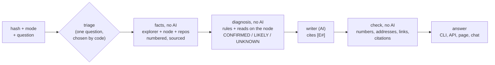

# AnyChain Transaction Assistant

Explains and troubleshoots a transaction on **any EVM network**, for a merchant ("why didn't my payment go through?"), a developer or an auditor. Every statement cites a numbered fact with its source (explorer, node, verified code, repository); the AI only writes from those facts, and a check rejects anything it adds. Switching networks means switching a YAML file.


---

## 1. Quickstart

Requires Python 3.11+ and [uv](https://docs.astral.sh/uv/). The written answer uses the local [Claude Code](https://claude.com/claude-code) CLI by default (logged in, no API key); without it, everything still runs and shows the facts only.

```bash
git clone <this repo> anychain && cd anychain
uv sync

# CLI: explain a transaction (a USDC transfer on Ethereum)
uv run anychain explain 0x7909bd56b9a3a0e932fa20ccd7093fcafcad133c51af652c921cd329b2307952 \
  --config configs/ethereum-mainnet.yaml

# the same code on another network, facts only (no model)
uv run anychain explain 0x7db4433fc318dfcf4a8d07022aec6135a5adb69b227f5a82e3092b3a648b0921 \
  --config configs/optimism-mainnet.yaml --no-llm

# a failure, with a question, as JSON
uv run anychain explain 0x73c4c0385483897a8c3cca6e4573c880dab32265bbacd94923fff2466cb45c8a \
  --config configs/ethereum-mainnet.yaml --mode developer --question "why did it fail?" --json

# API + web page on http://127.0.0.1:8000 (this machine only: the API has no authentication)
uv run anychain serve --config configs/ethereum-mainnet.yaml

# follow-up questions in the terminal, evaluation, usage metrics, tests (offline, real recordings)
uv run anychain chat 0x73c4c0385483897a8c3cca6e4573c880dab32265bbacd94923fff2466cb45c8a --config configs/ethereum-mainnet.yaml
uv run anychain eval
uv run anychain metrics --config configs/ethereum-mainnet.yaml
uv run pytest -q
```

With Docker (no secrets in the image; the port is published on the host's 127.0.0.1 only):

```bash
docker build -t anychain .
docker run --rm -p 127.0.0.1:8000:8000 anychain                                   # API + page, Ethereum
docker run --rm anychain anychain explain 0x7909bd56b9a3a0e932fa20ccd7093fcafcad133c51af652c921cd329b2307952 --no-llm
```

Do not run it with `--network host`: inside the container the API listens on 0.0.0.0, which with the host's network means every interface of the host. In a container the Claude Code CLI is not available: for a written answer set `llm.provider: anthropic` (or `openai`) in a mounted config and pass the key as an environment variable at run time.

**Interfaces:** `anychain explain <hash> [--mode support|developer|auditor] [--config path] [--json] [--evidence] [--question "…"] [--no-llm] [--fresh]`, `anychain chat`, `anychain batch <file>`, `anychain serve`, `anychain eval`, `anychain metrics`, `anychain log`, `anychain repos sync`. API: `POST /explain` (hash, mode, question?, clarified?), `POST /chat` (session_id), `POST /feedback`, `GET /health` (active network; explorer, node and model status).

---

## 2. Configuration, and retargeting to another network (e.g. CloudWalk)

Everything network-specific is in one YAML file (`configs/*.yaml`); there is no network value in the code (a test enforces it). Seven configs ship: Ethereum, Optimism, Gnosis, Rootstock, Celo, zkSync Era, and the CloudWalk template.

```yaml
network:    { name, chain_id, native_symbol, native_decimals, chain_type }   # chain_type = the explorer's Blockscout CHAIN_TYPE
explorer:   { type: blockscout, base_url, api_path: /api/v2, tx_url_template, address_url_template, timeout_s }
rpc:        { url, timeout_s, supports_debug_trace }                         # read-only JSON-RPC
repos:      [ { url, ref, source_globs, artifact_globs } ]                    # contract sources and ABIs, pinned
abi_strategy: { order: [explorer, repo_artifacts, repo_source_signatures, signature_db] }
llm:        { provider: claude_code | anthropic | openai, model, max_tokens }
assistant:  { default_mode, language, max_clarifying_questions, time_budget_s }
storage:    { sqlite_path, cache_dir }
```

**Retargeting to CloudWalk, step by step** (`configs/cloudwalk.example.yaml` is the commented template):

1. Copy the template to `configs/cloudwalk.yaml`.
2. `network`: chain id **2009** (mainnet) or **2008** (testnet), native currency **CWN** (public in chainid.network); `chain_type` as the internal Blockscout runs it (AnyChain warns when the explorer's answers look like another type).
3. `explorer.base_url` and `rpc.url`: the internal addresses (the public explorer names do not answer from outside). Keep `?app=anychain` on the RPC URL: Stratus can reject unidentified clients.
4. `repos`: the BRLC contracts, pinned to a commit (the template points to a public copy of the archived repository; prefer the internal official one).
5. `signature_db.enabled: false` if policy forbids sending selectors to a public service.
6. `uv run anychain repos sync --config configs/cloudwalk.yaml`, then `uv run anychain serve --config configs/cloudwalk.yaml`. `GET /health` confirms the explorer, the node (and that its chain id matches) and the model.

No code change is needed: the same steps took the tool from Ethereum to five other networks of five different types.

---

## 3. Architecture



- **Collectors:** the explorer (Blockscout API v2) and the network's node (JSON-RPC) are read in parallel, each request bounded by a time budget; every failure becomes a **gap** with a cause and a "worth retrying" flag, never an error on screen. The node checks the explorer (status, receipt, gas); a network-type profile handles fees, L1 status and deposits per chain type.
- **Decoder and ABI cascade:** explorer ABI (proxies and EIP-7702 delegates followed) → repo artifacts (the address checked against the artifact's own list) → signatures from repo sources → a public signature database (candidates only, never facts) → raw data, declared.
- **Diagnosis:** finds where a failure began (an inner call's execution error first), reads the reason at the top, proves it with reads on the node at the parent block (balance, allowance, owner, roles, paused, decimals), and checks that the conclusion explains every failure signal; a signal left over lowers CONFIRMED to LIKELY. Next steps for a non-technical reader and for a developer.
- **Context facts:** the called function's verified code (numbered lines, the reason's line), heuristic security notes, the sender's timeline around a failure (retries, approvals, repeated failures), gas notes.
- **Writer and check:** one prompt per mode; the model receives only the facts and the gaps (no API or node addresses); every number, address, hash, link and citation in its answer must be in the evidence, else it retries once, else the answer is withheld and the facts are shown.
- **Chat with tools:** the model asks for data in JSON (read a contract's state, show a function's code or a repo file, look at another transaction); our code checks and runs the request and adds the result as a new sourced fact.
- **Storage:** SQLite event log (one row per answer: gaps by cause, label, ABI source, cache, mode, tokens, cost, feedback) and a cache by network and hash for final, complete transactions.

The full diagrams (pipeline, diagnosis, one `explain`, the chat, quality, code map, gap classification, metrics) are in [docs/ARCHITECTURE.md](docs/ARCHITECTURE.md); every decision, with the real case behind it, is in [docs/DECISIONS.md](docs/DECISIONS.md) (D1 to D58).

---

## 4. Sample conversations

Real transactions replayed from their recordings and answered by the model through the same path as `explain` and the API; generated by `scripts/sample_conversations.py`, not edited by hand (also in [docs/SAMPLES.md](docs/SAMPLES.md)). The answers are in Portuguese, the configs' `assistant.language`. No recorded failure has both an `eth_call` read and a repository citation, so the second and third samples show one each.

### A successful ERC-20 transfer, support mode

Network `ethereum-mainnet`, transaction `0x7909bd56b9a3a0e932fa20ccd7093fcafcad133c51af652c921cd329b2307952`, mode `support`.

**Assistant:**

**O que aconteceu:** A transação foi concluída com sucesso no bloco 26141501 [E1]. A rede Ethereum confirmou esse resultado de forma independente [E7].

**O dinheiro foi movido?** Sim. Foram transferidos 69,3484 USDC da carteira 0xCA62C34d54b445283121905F19193416212117c4 para a carteira 0x74AA5387681505c806FF1E972B12cdfd01406828 [E5]. Nenhum ETH foi enviado nessa operação [E1]. A transferência foi feita chamando a função "transfer" do contrato do USDC [E3].

**O que a função faz:** Segundo o código mostrado, a função só roda se o contrato não estiver pausado e se nem quem envia nem quem recebe estiver numa lista de bloqueio. Depois disso, ela move o valor do remetente para o destinatário [E4]. O código exibido é o da versão atual listada no explorador, que pode ter sido atualizada depois desta transação [E4].

**Taxa cobrada:** A taxa de rede foi de 0,00008537619972948 ETH [E2]. Foram usadas 40360 unidades de gás, de um limite de 45758 [E1].

**O que fazer:** Não há nenhum problema a corrigir. Se você esperava receber esse pagamento, confira se a carteira 0x74AA5387681505c806FF1E972B12cdfd01406828 é a sua e se o valor de 69,3484 USDC é o combinado [E5]. Se algo não bater, entre em contato com quem enviou o pagamento e mostre a página da transação: https://eth.blockscout.com/tx/0x7909bd56b9a3a0e932fa20ccd7093fcafcad133c51af652c921cd329b2307952 [E1].

### A failure diagnosed with reads on the node (eth_call), developer mode

Network `celo-mainnet`, transaction `0x9a8b0c69355a900965e9d3ddb4f4a7d2bb8822872d36e3ba03b55e4e7f419817`, mode `developer`.

**Assistant:**

**Resumo**

A transação falhou (revert) no bloco 78962884 [E1]. O motivo reportado é `ERC20: transfer amount exceeds balance` [E3]. O saldo do remetente era menor que o valor pedido [E10].

**Chamada decodificada**

- Chamada: `transfer(address,uint256)` em 0x48065fbBE25f71C9282ddf5e1cD6D6A887483D5e (Tether USD), com `recipient=0x14634De7D71618013Dc48F2e85E80A28023f4367` e `amount=106500` [E4].
- Origem: 0x9695B8367fd1Bb4800667Ff5F35B0CF142F410A0, valor nativo 0 CELO [E1].
- Fonte do ABI: explorer, contrato verificado TransparentUpgradeableProxy (proxy) -> TetherTokenCeloExtension [E4].
- Gas usado: 33839 de um limite de 100000 [E1].
- Taxa paga: 0,008222877 CELO, cobrada mesmo com a falha [E2].

**Transferências de tokens e eventos**

Nenhuma transferência ocorreu, pois a transação reverteu. Não há eventos nas evidências [E1].

**Chamadas internas**

- Delegatecall de 0x48065fbBE25f71C9282ddf5e1cD6D6A887483D5e (Tether USD) para 0xBF83F8436Ac46A8B1da5A9348eD84F68aEe07B98 (TetherTokenCeloExtension). Essa chamada interna falhou com "execution reverted" [E6].

**Código**

- `transfer` em ERC20Upgradeable (linhas 117-120) apenas chama `_transfer(_msgSender(), recipient, amount)` e retorna `true` [E5].
- A fonte é da implementação listada hoje pelo explorer e pode ter sido atualizada desde esta transação [E5].
- Em `_transfer`, a razão está escrita somente na linha 236 do arquivo `@openzeppelin/contracts-upgradeable/token/ERC20/ERC20Upgradeable.sol`: `require(senderBalance >= amount, "ERC20: transfer amount exceeds balance");`. O erro foi, mais provavelmente, gerado ali, a menos que tenha sido repassado de outra função ou contrato chamado [E11][E12].

**Diagnóstico**

- CONFIRMED: no bloco 78962883, o saldo de 0x9695B8367fd1Bb4800667Ff5F35B0CF142F410A0 era 1445 unidades brutas (0,001445 USD₮), menor que as 106500 unidades (0,1065 USD₮) pedidas [E7][E10].
- Os valores usam `decimals()` = 6 e `symbol()` = USD₮, lidos no bloco 78962883 [E8][E9].
- Próximo passo (dev): verificar o saldo da conta de origem antes de enviar e transferir no máximo esse valor [E10].
- Próximo passo (dev): se o saldo era esperado, procurar uma transação anterior que o tenha gasto [E10].

**Padrão de repetição**

- Esta é a transação de nonce 54516; os nonces 54513, 54514 e 54515 também falharam com `transfer` para o mesmo contrato [E13].
- A mesma chamada `transfer` falhou ao menos 35 vezes seguidas, sem outra transação do remetente no meio (nonces 54482 a 54516) [E14].
- Isso sugere um processo automatizado que reenvia sem verificar o saldo, mas as evidências não confirmam isso.

**Notas**

- Nota de gas (heurística): 33839 de 100000 usados (33,8%) [E15].
- Não há notas de segurança nas evidências.

**Lacunas**

- Linha do tempo: o remetente enviou ao menos 150 transações depois desta e as seguintes não são mostradas. Para vê-las, abra a página do remetente no explorer [E1].

**Missing data the answer declares:**

- Timeline: the sender sent at least 150 transactions after this one; those right after it are not shown

### A failure diagnosed from the contract's verified code and the rule's repository source, with the sender's timeline, developer mode

Network `ethereum-mainnet`, transaction `0x73c4c0385483897a8c3cca6e4573c880dab32265bbacd94923fff2466cb45c8a`, mode `developer`.

**Assistant:**

# Transação revertida: `UniswapV2Router: EXPIRED`

**Status:** a transação falhou (reverted) no bloco 26149091, em 2026-10-08T17:11:47Z [E1]. O receipt via RPC confirma o status de falha [E8].

**Causa (CONFIRMED):** o parâmetro `deadline` da chamada é 2400 (1970-01-01T00:40:00Z), e o timestamp do bloco é 1791479507 (2026-10-08T17:11:47Z). O prazo já tinha expirado quando a transação foi incluída, e `UniswapV2Router: EXPIRED` é a verificação de deadline da Uniswap [E6]. O explorer reporta o motivo `Error(string reason)` com `reason='UniswapV2Router: EXPIRED'` [E3].

**Linha do motivo:** o texto `UniswapV2Router: EXPIRED` está escrito no código-fonte verificado `contracts/UniswapV2Router02.sol`, linha 19 [E7]. As linhas dessa região não foram incluídas na evidência, só a referência de linha.

**Chamada decodificada** (ABI: contrato verificado `UniswapV2Router02` no explorer) [E4]:
- Função: `swapExactETHForTokens(uint256,address[],address,uint256)` em `0x7a250d5630B4cF539739dF2C5dAcb4c659F2488D` [E4]
- `amountOutMin=0` [E4]
- `path=[0xC02aaA39b223FE8D0A0e5C4F27eAD9083C756Cc2, 0xA0b86991c6218b36c1d19D4a2e9Eb0cE3606eB48]` [E4]
- `to=0x79D6C25dE86bC4A858d7e383A474667aB109FeD0` [E4]
- `deadline=2400` [E4]
- Valor nativo anexado: 0.045 ETH, não transferido porque a transação reverteu [E1]

**O que a função faz** (linhas 252-266): ela é `payable` e usa o modificador `ensure(deadline)` (apenas citado pelo nome; seu código não foi fornecido) [E5]. Depois exige `path[0] == WETH`, calcula `amounts` com `UniswapV2Library.getAmountsOut` usando `msg.value`, e exige que a última quantidade seja `>= amountOutMin` [E5]. Em seguida chama `IWETH(WETH).deposit`, transfere o WETH ao par com `transfer` e executa `_swap(amounts, path, to)` [E5]. A reversão ocorreu antes desses passos, no check de deadline.

**Transferências de tokens, chamadas internas e eventos:** a evidência não lista nenhum. Isso é coerente com a reversão logo no início, mas a evidência não afirma isso explicitamente.

**Gás e taxa:**
- Gás usado: 25320 de um limite de 300000 [E1].
- Taxa paga: 0.00011683874115936 ETH, cobrada mesmo com a falha [E2].
- Nota heurística: a mesma chamada teve sucesso no nonce 53 usando 119837 de gás, com limite de 300000 [E11].

**Contexto do remetente:** esta transação é o nonce 52 [E9]. A mesma chamada `swapExactETHForTokens` teve sucesso 48 segundos depois, no nonce 53 [E10].

**Próximo passo (desenvolvedor):** verifique o preço atual e reenvie com um novo `deadline` (e uma taxa alta o suficiente para inclusão a tempo) [E6].

**Notas de segurança:** não há evidência do tipo `security_note`, então nada é afirmado sobre segurança.

### A contract the explorer has not verified (degradation), with a clarifying question (triage)

Network `ethereum-mainnet`, transaction `0x68098e2a69deadd1f60396d667781517a5cfdf257a5e35f79f0c47c52f5f51c9`, mode `support`.

**Assistant asks:** What were you trying to do? The failure's words are those of a swap's minimum-output (slippage) check, but this contract's own code decides what they mean here.

- Swap or trade tokens
- Something else

**Reader answers:** Something else

**Assistant:**

**O que aconteceu:** a transação falhou (foi revertida) no bloco 26141518 [E1]. A rede (via RPC) confirma de forma independente que ela falhou [E18].

**O dinheiro se moveu?** Não. A transação não carregava valor em ETH (0 ETH) [E1]. As tentativas internas de enviar cerca de 0,0915 ETH foram desfeitas, e nada foi transferido [E11][E12].

**Quanto foi cobrado:** a taxa foi de 0,000294067451118215 ETH. Ela é cobrada mesmo com a falha [E2].

**Causa:** UNKNOWN. O explorador informa o motivo "INSUFFICIENT_OUTPUT_AMOUNT" [E3]. Essas palavras costumam aparecer na verificação de preço mínimo de uma troca (swap) [E17]. Isso é apenas uma possibilidade. Você disse que não estava trocando tokens, o que não combina com essa leitura [E23]. O significado real depende do código do contrato, que não está disponível nas evidências [E23]. Não foi possível decodificar a chamada, porque não há ABI correspondente ao seletor 0x70521ae9 [E4]. A consulta ao banco de assinaturas também falhou, mas pode ser tentada de novo depois.

**Contexto:** a mesma chamada, feita pelo mesmo remetente, falhou algumas vezes e teve sucesso em outras nas horas ao redor [E19]. Ela funcionou 372 segundos depois desta falha [E20]. Isso sugere que o problema depende das condições do momento, mas as evidências não confirmam isso.

**O que fazer:**
- Confirme com o aplicativo ou serviço que enviou essa operação o que ela deveria fazer, pois não foi possível identificar isso pelos dados [E4].
- Se ela mexe com preço ou troca, verifique o preço atual e tente de novo com um valor menor ou com um limite adequado. Se não resolver, procure o suporte do aplicativo [E17].
- Para uma análise melhor, é preciso o contrato verificado no explorador ou o ABI dele [E4].

**Missing data the answer declares:**

- Call decoding: no ABI for 0x278d858f05b94576C1E6f73285886876ff6eF8D2 matches selector 0x70521ae9
- Signature database: the recording has no answer from this source, so the replay treats it as unavailable

### Triage: it succeeded, but the reader says the payment did not arrive

Network `ethereum-mainnet`, transaction `0x7909bd56b9a3a0e932fa20ccd7093fcafcad133c51af652c921cd329b2307952`, mode `support`.

**Reader:** não recebi o pagamento

**Assistant asks:** Which payment did you expect? Pick the one below, or type the address that should have received it.

- Token transfer: 69.3484 USDC from 0xCA62C34d54b445283121905F19193416212117c4 to 0x74AA5387681505c806FF1E972B12cdfd01406828.

**Reader answers:** 0x000000000000000000000000000000000000dEaD

**Assistant:**

**Resposta à sua pergunta:** a transação foi concluída com sucesso, mas o pagamento não foi para o endereço que você esperava.

- A transação teve sucesso no bloco 26141501 [E1], e a rede confirmou isso de forma independente [E7].
- Foram enviados 69,3484 USDC do endereço 0xCA62C34d54b445283121905F19193416212117c4 para o endereço 0x74AA5387681505c806FF1E972B12cdfd01406828 [E5].
- Você disse que esperava um pagamento para 0x000000000000000000000000000000000000dEaD. Nenhuma das movimentações listadas foi para esse endereço [E9]. A comparação tem um limite: tokens que o explorador esconde, como os marcados como golpe, não aparecem na lista [E9].

**O dinheiro se moveu?** Sim. O valor saiu do remetente e foi para o endereço 0x74AA…6828 [E5]. O código mostrado da função de transferência apenas move o valor de quem envia para o destinatário informado [E4]. Esse código é da versão que o explorador lista hoje, e o contrato pode ter sido atualizado desde essa transação [E4].

**Taxa cobrada:** 0,00008537619972948 ETH [E2]. Nenhum ETH foi enviado como pagamento [E1].

**O que fazer:**
1. Confira se o endereço 0x74AA5387681505c806FF1E972B12cdfd01406828 é o da sua carteira ou da sua loja [E5].
2. Se não for, peça a quem pagou que confirme o endereço usado. Os dados mostram que o pagamento foi para esse endereço, e não para o que você esperava [E5][E9].
3. Se for o seu endereço, verifique se a sua carteira exibe USDC. Pode ser necessário adicionar o token manualmente. Isso é uma sugestão geral, e não consta nas evidências.

Posso ajudar a explicar mais algum detalhe se você me disser qual endereço é o da sua loja.

Link da transação: https://eth.blockscout.com/tx/0x7909bd56b9a3a0e932fa20ccd7093fcafcad133c51af652c921cd329b2307952

---

## 5. Evaluation results

`anychain eval` replays 10 real transactions from their recordings (8 on Ethereum, 2 on Optimism; `eval/cases.yaml`) through the whole pipeline, the model included, and measures the answer. Latest run ([eval/report.md](eval/report.md)):

Run 2026-10-08 21:23, commit 3827d6c, model claude-sonnet-5-5. Every case is a real transaction replayed from its recording (eval/cases.yaml).

| Metric | Result |
|---|---|
| Status accuracy | 100.0% |
| Diagnosis rule and label accuracy | 100.0% |
| ABI source accuracy | 100.0% |
| Degradation declared correctly | 100.0% |
| Citation coverage (factual sentences citing a fact) | 77.2% |
| Hallucination rate (first attempt with values not in the evidence) | 10.0% |
| Key values present in the answer | 100.0% |
| Values the check caught on a first attempt | 1 |
| Answers withheld | 0 of 10 |
| Time per written answer | 11.7 s |
| Tokens (input, output, cache read, cache write) | 22, 10301, 14490, 43804 |
| Cost reported by the backend | 0.2812 USD |

| Case | Network | Status | Rule / label | ABI | Gaps | Answer | Cited | Values |
|---|---|---|---|---|---|---|---|---|
| erc20_transfer | ethereum-mainnet | ok success | ok -  | ok explorer |  - | ok | 11/13 | 2/2 |
| dex_swap | ethereum-mainnet | ok success | ok -  | ok explorer |  - | ok | 27/29 | 2/2 |
| explicit_reason | ethereum-mainnet | ok failed | ok deadline CONFIRMED | ok explorer |  - | ok | 17/22 | 2/2 |
| inner_out_of_gas | ethereum-mainnet | ok failed | ok out_of_gas LIKELY | ok explorer |  - | ok | 13/17 | 2/2 |
| out_of_gas | ethereum-mainnet | ok failed | ok out_of_gas CONFIRMED | ok explorer |  not_interpretable | retried | 14/16 | 1/1 |
| unverified_contract | ethereum-mainnet | ok failed | ok slippage LIKELY | ok raw |  not_interpretable, source_unavailable | ok | 20/34 | 1/1 |
| custom_error | ethereum-mainnet | ok failed | ok contract_reason CONFIRMED | ok raw |  not_interpretable | ok | 22/28 | 1/1 |
| node_unavailable | ethereum-mainnet | ok success | ok -  | ok explorer | ok source_unavailable | ok | 13/16 | 1/1 |
| second_network_transfer | optimism-mainnet | ok success | ok -  | ok explorer |  - | ok | 10/15 | 2/2 |
| second_network_failure | optimism-mainnet | ok failed | ok deadline LIKELY | ok signature_db |  not_interpretable | ok | 12/16 | 1/1 |

The allowance category has no real case and is reported as missing, not filled: the candidate found turned out to be an inner out-of-gas (D50, D51). "Hallucination" counts first attempts the check caught; the one caught here cited a fact id that does not exist ("E624"), and the retry was clean: no answer reached a reader with it.

**Acceptance against an independent source:** 1,800 randomly sampled transactions (300 on each of six networks), checked against the network's node: six checks each (status, value, fee, token transfers, no double-counted native value, addresses exist) plus the L1 status on zkSync, 11,100 checks in all: 11,008 passed, 88 had no node data to compare, 4 flagged. The 3 false facts found (a missing receipt called "pending", a blob fee left out on Gnosis) were fixed with tests on the recorded cases; the fourth is a token the explorer hides as scam ([docs/acceptance-report.md](docs/acceptance-report.md)). The run used the Phase 3 code: the Phase 4 facts (timeline, gas notes, triage) come from the same explorer lists and are covered by tests on recordings, not by this run.

---

## 6. Metrics and measuring impact in production

`anychain metrics` prints usage numbers from the event log, each with the SQL that computes it: failure causes per network, conclusion labels, where ABIs came from, satisfaction (👍/👎) by mode, cache hit rate. How the tool would be put in front of support, the hypothesis, primary and guard metrics, the rollout experiment and the criteria to scale or roll back are in [docs/IMPACT.md](docs/IMPACT.md).

---

## 7. Known limits and next steps

- **Public infrastructure:** public nodes keep the state of about the last 128 blocks, so reads at the parent block of an older failure are refused (said as a gap); one public node returns some old transactions without a receipt (the outcome is then "unknown", D53). An archive node removes both.
- **No trace yet:** where the explorer's internal calls do not show the failing frame, `debug_traceTransaction` would (`rpc.supports_debug_trace`; Stratus serves it). Not used with the public nodes here.
- **Explorer-hidden tokens:** a token the explorer marks as scam has its transfers hidden; the tool does not say so yet (backlog C1).
- **Heuristics stay heuristics:** security and gas notes are pattern matches on the shown code, never an audit.
- **Private demo network:** the planned Anvil + self-hosted Blockscout + BRLC deployment (docs/ROADMAP.md) proves the CloudWalk retargeting end to end; see its status in the roadmap.
- **Backlog:** imprecise wordings found by reviews and acceptance runs (level C), each with the real transaction it came from, in docs/ROADMAP.md.

---

## 8. How AI was used to build this

The code, tests and documents were written with Claude Code, in phases (each with a written spec, approved before any code, in `docs/specs/`). The human decisions, recorded in `docs/DECISIONS.md` with dates, were mine: the scope and the order of the phases; the acceptance criterion (zero false facts of level A or B on 300 sampled transactions per network, checked against the node); which imprecise wordings to fix now and which to keep for later; running the writer on Claude Code instead of an API key; the retargeting target (CloudWalk) and its sources; and, after the evaluation found a rule that ignored an inner out-of-gas, asking for the diagnosis to start from the failure's origin. The process the model followed: a failing test before each fix, written from a real recorded transaction (nothing in the tests is invented); a review by a separate agent with a clean context before commits; and an independent acceptance run against the network's own node at the end of each phase.
