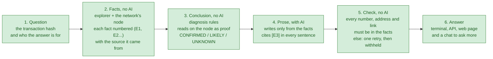
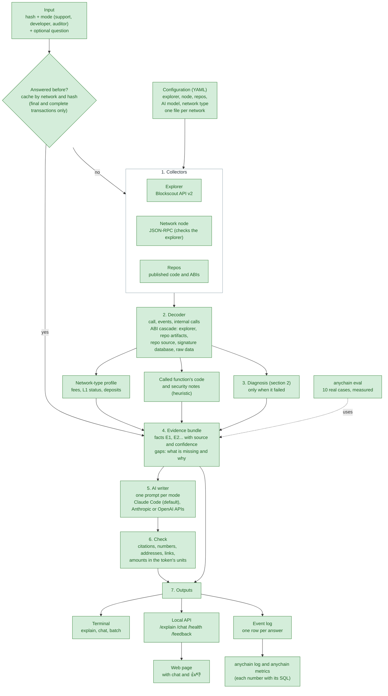
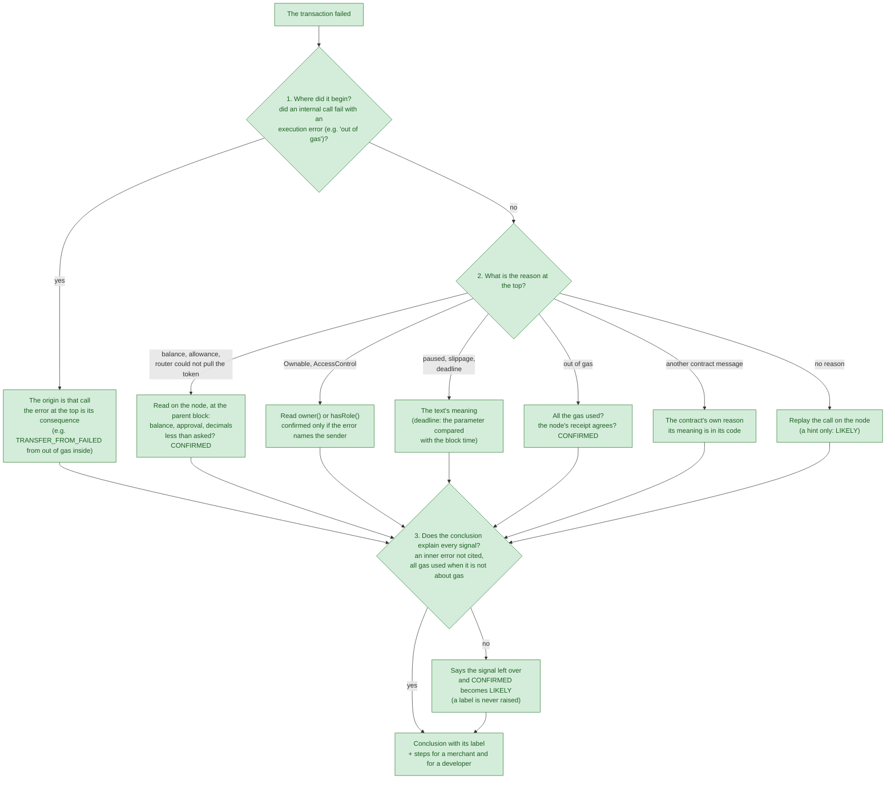
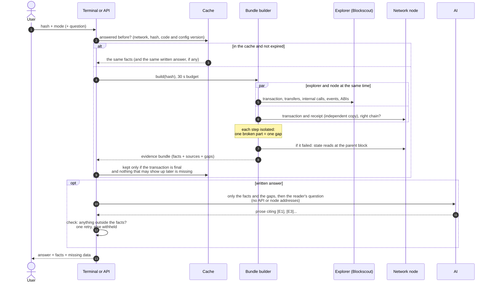
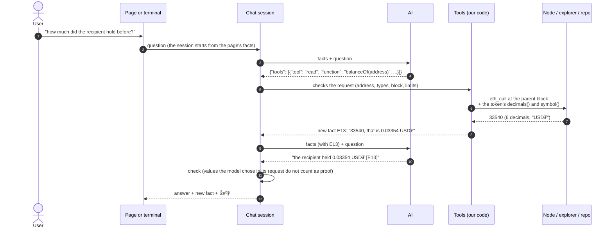
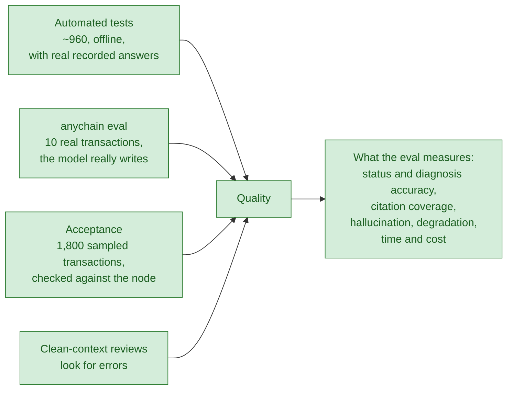
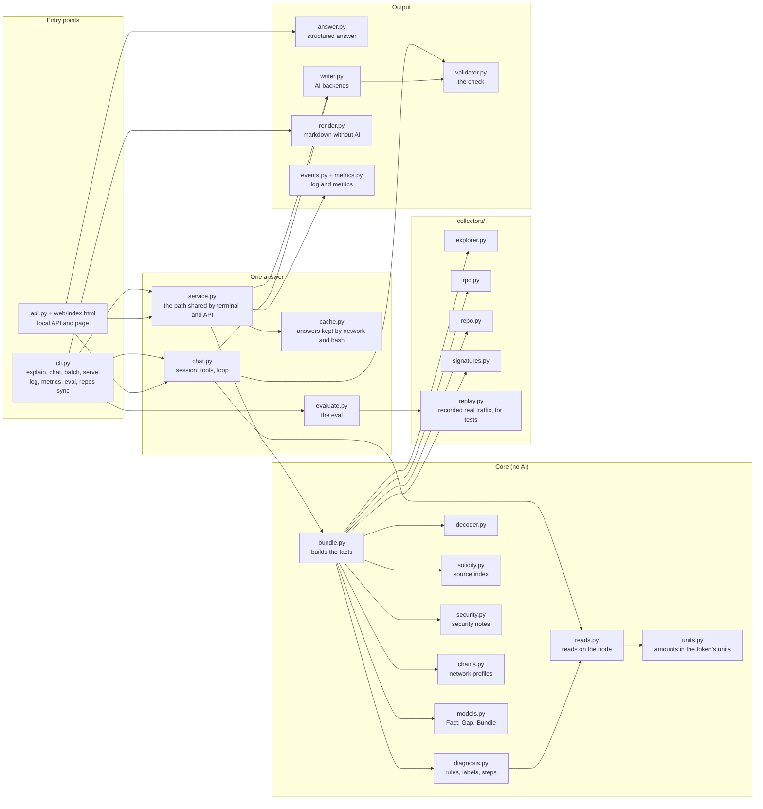
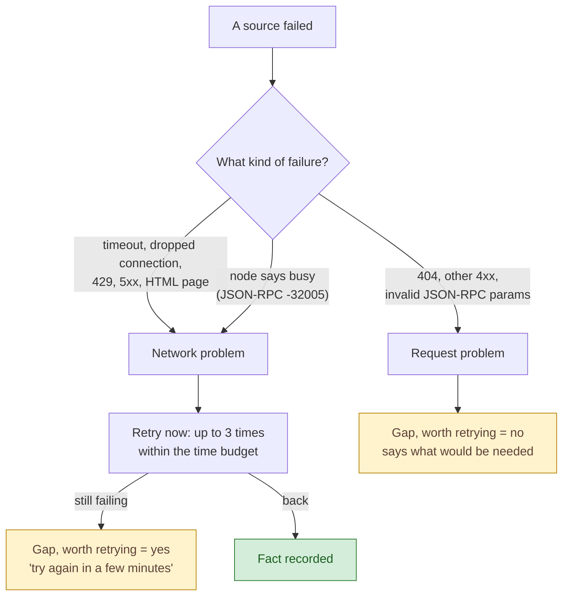
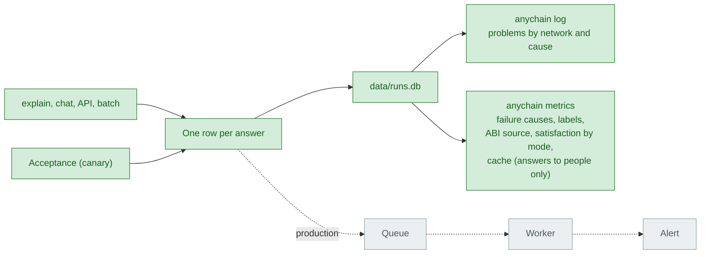

# Architecture

Living document: updated at the end of every phase. Colors show what exists. A Portuguese version is kept in `ARCHITECTURE.pt-BR.md`.

- **Green**: built and tested
- **Yellow**: being built in this phase
- **Grey**: later phases
- White boxes are only groupings.

View the diagrams in VS Code (extension "Markdown Preview Mermaid Support") or on GitHub, which renders them natively.

Current state: **end of phase 3** (2026-10-08): cache, metrics, API, chat, web page, evaluation, production impact page (`docs/IMPACT.md`), the reader's question with the hash, the recorded demo (`docs/demo/`) and the 1,800-transaction acceptance run.

---

## 0. What this is, in one minute

An assistant that **explains a blockchain transaction** to someone non-technical (a merchant: "why didn't my payment go through?") and to someone technical (a developer, an auditor), on **any EVM network**, by changing only the configuration.

The idea behind everything: **the AI finds nothing out; it only writes.** The code finds things out, and code can be tested.

Why this way:

- **If the AI makes a mistake, the check catches it.** A number that is not in the facts never reaches the customer.
- **If a rule makes a mistake, it can be found and fixed with a test.** That happened in phase 3: the evaluation found a rule that ignored an inner call running out of gas; the rule was fixed and the real case became a test (D50, D51).
- **When data is missing, the answer says what is missing** ("the explorer did not answer; try again") instead of guessing.

---

## 1. The pipeline

| Phase | What it adds |
|---|---|
| 1 (done) | configuration, explorer and node collectors, decoder, evidence bundle, AI writer, terminal |
| 2 (done) | failure diagnosis, state reads, repos, ABI cascade, confidence per fact, answer check |
| 2.5 (done) | function code, security notes, ABIs from artifacts, access control, deadline parameter, labels, steps per reader, structured answer |
| 3 (done) | cache and batch, metrics, API, chat with tools, web page, amounts in the token's units, evaluation, origin-first diagnosis, the reader's question, impact page, recorded demo |
| 4 | triage (start from the problem, no hash), multi-transaction timeline, gas notes, node trace, private demo network, Dockerfile, final README |

---

## 2. How the diagnosis decides (only when the transaction failed)

Rules written in code, in the order below. Each conclusion carries a label: **CONFIRMED** (proven by the decoded reason or a read on the node), **LIKELY** (suggested by a pattern) or **UNKNOWN** (no data to conclude; the answer says what is missing).

Steps 1 and 3 came in after the evaluation showed the weak point of starting only from the text at the top (D51).

---

## 3. What happens on one `explain` call

Retries, the time budget and the detours, in the order they happen. Every failure becomes a **gap**, never a technical error on screen.

---

## 4. The chat with tools

After the explanation, the reader can ask more. **The model runs nothing**: when it needs data it asks for it in JSON, and our code checks the request, runs it and returns it as a new fact with a source.

Tools: `read` (a contract's state), `code` (a function's code), `file` (a file of a configured repo), `transaction` (another transaction). At most 3 per question and 10 questions per conversation.

---

## 5. How quality is measured

Eval results are in `eval/report.md`; acceptance results in `docs/acceptance-report.md`.

---

## 6. Code map

Which file does what, and who calls whom. Suggested reading order: `service.py`, then `bundle.py`, then `diagnosis.py`.

---

## 7. How a gap is classified

The "worth retrying" flag is what would let production send only network failures to a queue (D11).

Besides "worth retrying", every gap carries a **cause**, which is what the event log counts (D24):

| Cause | Meaning | A problem? |
|---|---|---|
| `source_unavailable` | the source did not answer (timeout, 5xx, rate limit) | yes, alert if the rate rises |
| `source_error` | the source refused or sent something unreadable (4xx, node error, missing field) | yes |
| `source_behind` | the explorer has not indexed it yet, or disagrees with the node | yes, if it persists |
| `processing_error` | our code broke on that data, or our arithmetic contradicts a source | yes, always a defect |
| `config_error` | the configuration does not match the sources (wrong chain id or network type) | yes |
| `pending` | the transaction is not mined yet | no |
| `not_interpretable` | no ABI, truncated list, unknown field, hash not found: an expected limit | no |

---

## 8. Event log, metrics and alerts

Every answer becomes one row in a local SQLite file: network, hash, duration, gaps with cause, diagnosis label and rule, ABI source, cache state, mode, tokens, cost and the 👍/👎. `anychain log` lists problems; `anychain metrics` prints usage numbers, each with the SQL that computes it. In production the same event would go to a queue and a worker would aggregate and alert: that part is design only.

---

## Changelog of this document

- **2026-10-08, end of phase 3 (D44 to D53):** a one-minute overview; cache by network and hash and batch; metrics with SQL; local API and page; chat with tools run by our code; amounts in the token's units, read from the token itself; evaluation with 10 real cases; diagnosis that starts from the failure's origin and says every signal its conclusion leaves unexplained; the reader's question; a mined transaction without a receipt is "unknown", never "pending". New sections: how the diagnosis decides, the chat with tools, how quality is measured.
- **2026-10-08, end of phase 2.5 (D38 to D43):** the model gets the called function's code (and the reason's line when the code pins it down); heuristic security notes; ABIs from repo artifacts, the address checked against the file's own list; access-control and deadline-parameter rules; CONFIRMED / LIKELY / UNKNOWN labels on each conclusion and in the log; steps for a merchant and for a developer; structured answer (`--json`). Header and code map brought up to date (phase 2 modules were missing).
- **2026-10-08, repos and signatures (D33 to D35, PHASE2 T6 and T7):** configured repos synced to a cache, cited and compared with the verified source, used to decode unverified contracts; public signature database as candidates, event signatures proven by hash.
- **2026-10-08, diagnosis and replay (D29 to D32, PHASE2 T2 to T5):** confidence per fact, state reads, failure diagnosis, replay when the explorer has no reason.
- **2026-10-08, validator (D28, PHASE2 T1):** the written answer is checked against the evidence, retried once with the problems, else withheld.
- **2026-10-08, LLM backends (D27):** the writer runs on the local Claude Code CLI by default; the Anthropic and OpenAI APIs are config options for a deployed service.
- **2026-10-08, level C fixes (D26):** explorer requests in parallel and fetched once; the internal-call cutoff keeps every call that moved value; reverts worded as the explorer reports them.
- **2026-10-07, zkSync L1 status (D25):** the explorer's status is never asserted; the profile confirms it with the node (`node_facts`); every gap must name its cause, with the new cause `config_error`.
- **2026-10-07, event log (D24):** every gap has a cause; every answer becomes an event in local SQLite, queried with `anychain log`; production design with a queue and a worker (not built).
- **2026-10-07, typed objects (D21):** explorer and RPC answers become typed objects once, in `collectors/types.py`.
- **2026-10-07, chain-type profiles (D20):** config names the Blockscout CHAIN_TYPE; profiles for six network types; address labels in config.
- **2026-10-07, phase 1 review rounds:** EIP-7702 delegates as an ABI source; accounts without code today are never asserted codeless (D18).
