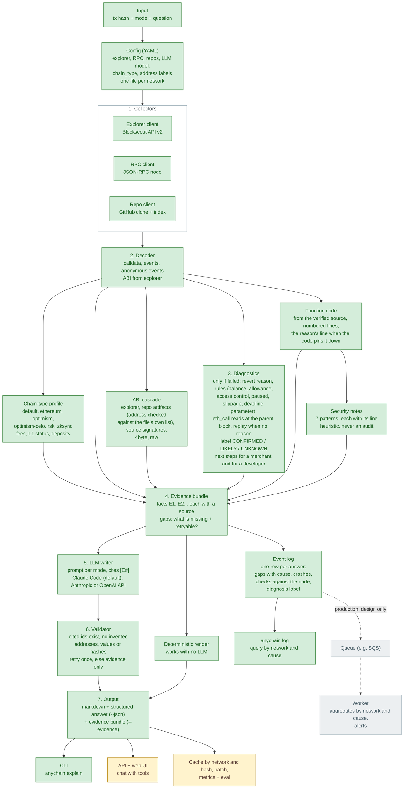
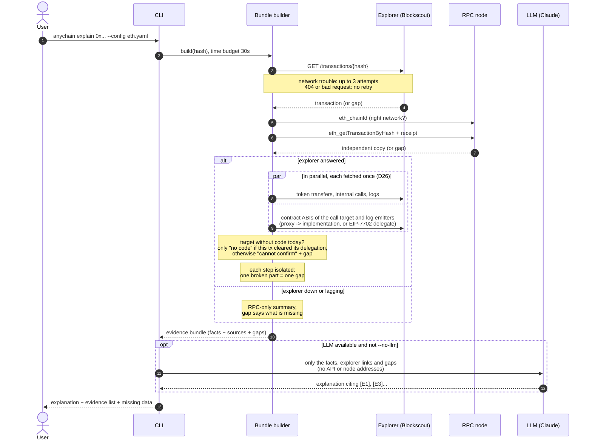
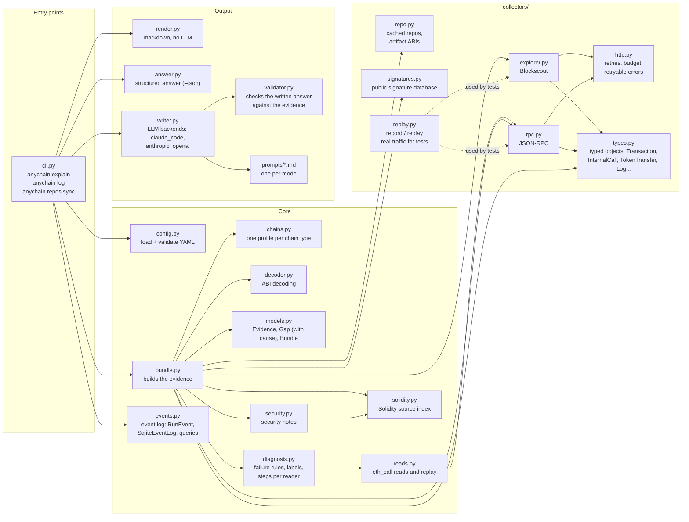
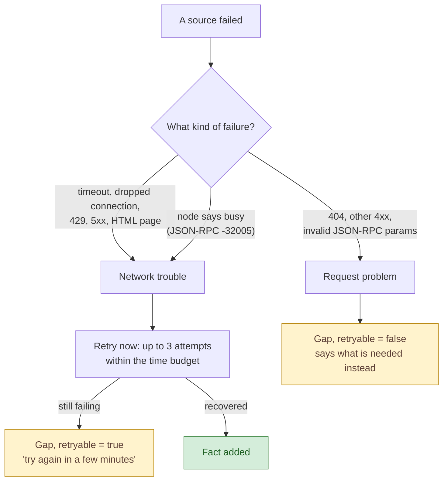
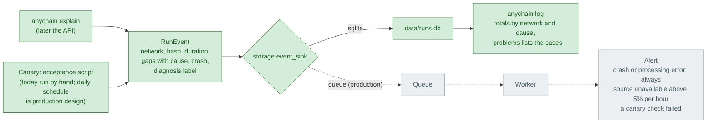

# Architecture

Living document: updated at the end of every phase. Colors show what exists. A Portuguese version is kept in `ARCHITECTURE.pt-BR.md`.

- **Green**: built and tested
- **Yellow**: next phase
- **Grey**: later phases
- White boxes are only groupings.

View the diagrams in VS Code (extension "Markdown Preview Mermaid Support") or on GitHub, which renders them natively.

Current state: **end of phase 2.5** (2026-10-08).

---

## 1. The pipeline

One rule shapes everything: facts are collected **without any AI**, numbered, and given a source. The AI only writes prose from those facts, and (from phase 2) a validator checks it did not invent anything.

| Phase | Adds |
|---|---|
| 1 (done) | config, explorer + RPC collectors, decoder with explorer ABI, evidence bundle, LLM writer, CLI |
| 2 (done) | diagnostics for failures, `eth_call` state reads, repo grounding, ABI cascade, confidence levels, validator |
| 2.5 (done) | function code as evidence, security notes, ABIs from repo artifacts, access control, deadline parameter, CONFIRMED / LIKELY / UNKNOWN labels, steps per reader, structured answer (`--json`) |
| 3 | cache by network and hash, batch, API, web UI, chat with tools, metrics, eval suite |
| 4 | triage questions, multi-transaction timeline, gas notes, `debug_traceTransaction`, private demo network |

---

## 2. What happens on one `explain` call

Retries, the time budget and the fallbacks, in order. Every failure becomes a **gap** instead of an error on screen.

---

## 3. Code map

Which file does what, and who calls whom.

---

## 4. How a gap is classified

The `retryable` flag is what would let production send only network failures to a retry queue (see DECISIONS D11).

Besides "retryable", every gap carries a **cause**, which the event log counts (D24). Every gap site must name one:

| Cause | Meaning | Problem? |
|---|---|---|
| `source_unavailable` | a source did not answer (timeout, 5xx, rate limit) | yes, alert when the rate rises |
| `source_error` | a source refused or sent something unreadable (4xx, node error, missing field) | yes |
| `source_behind` | the explorer has not indexed it yet, or disagrees with the node | yes, if it persists |
| `processing_error` | our code failed on the payload, or our arithmetic contradicts a source | yes, always a defect |
| `config_error` | the network config does not fit the sources (wrong chain id or chain type) | yes |
| `pending` | the transaction is not mined yet | no |
| `not_interpretable` | no ABI, list truncated, unknown field, hash not found | no |

---

## 5. Event log and alerts

Today the log is a local SQLite file queried with `anychain log`. In production the same event would go to a queue and a worker would aggregate and alert; that part is design only.

The canary is the only way to catch the silent kind (a false fact nothing flagged), which is why the acceptance run writes to the same log with source `canary`.

---

## Changelog of this document

- **2026-10-07, end of phase 1:** first version. Pipeline, call sequence, code map, gap classification.
- **2026-10-08, end of phase 2.5 (D38 to D43):** the model gets the called function's code (and the reason's line when the code pins it down); heuristic security notes; ABIs from repo artifacts, the address checked against the file's own list; access-control and deadline-parameter rules; CONFIRMED / LIKELY / UNKNOWN labels on each conclusion and in the log; steps for a merchant and for a developer; structured answer (`--json`). Header and code map brought up to date (phase 2 modules were missing).
- **2026-10-08, repos and signatures (D33 to D35, PHASE2 T6 and T7):** configured repos synced to a cache, cited and compared with the verified source, used to decode unverified contracts; public signature database as candidates, event signatures proven by hash.
- **2026-10-08, diagnosis and replay (D29 to D32, PHASE2 T2 to T5):** confidence per fact, state reads, failure diagnosis, replay when the explorer has no reason.
- **2026-10-08, validator (D28, PHASE2 T1):** the written answer is checked against the evidence, retried once with the problems, else withheld.
- **2026-10-08, LLM backends (D27):** the writer runs on the local Claude Code CLI by default; the Anthropic and OpenAI APIs are config options for a deployed service.
- **2026-10-08, level C fixes (D26):** explorer requests in parallel and fetched once; the internal-call cutoff keeps every call that moved value; reverts worded as the explorer reports them.
- **2026-10-07, zkSync L1 status (D25):** the explorer's status is never asserted; the profile confirms it with the node (`node_facts`); every gap must name its cause, with the new cause `config_error`.
- **2026-10-07, event log (D24):** every gap has a cause; every answer becomes an event in local SQLite, queried with `anychain log`; production design with a queue and a worker (not built).
- **2026-10-07, typed objects (D21):** explorer and RPC answers become typed objects once, in `collectors/types.py`.
- **2026-10-07, chain-type profiles (D20):** config names the Blockscout CHAIN_TYPE; profiles for six network types; address labels in config.
- **2026-10-07, phase 1 review rounds:** EIP-7702 delegates as an ABI source; accounts without code today are never asserted codeless (D18).
