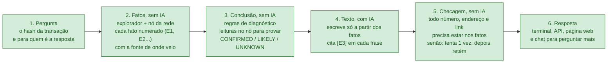
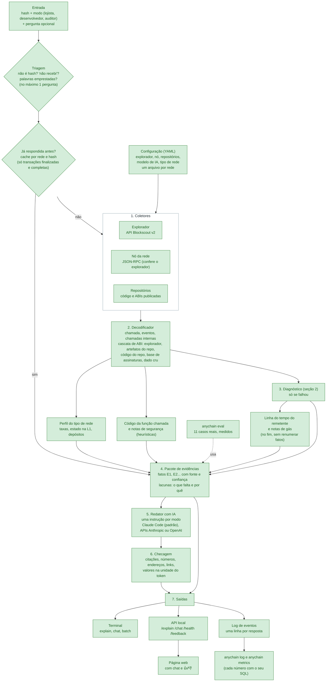
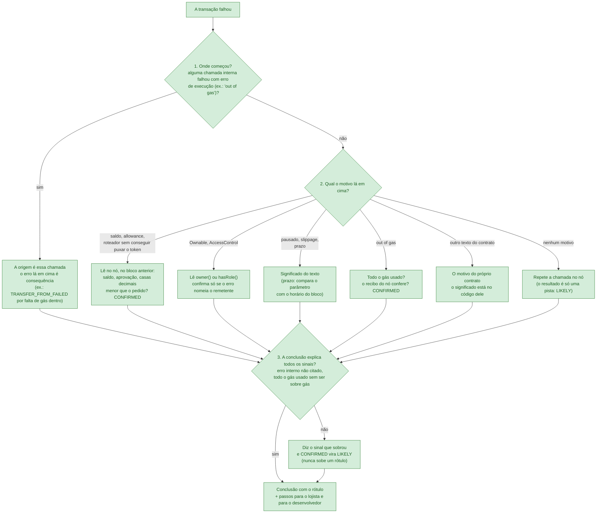
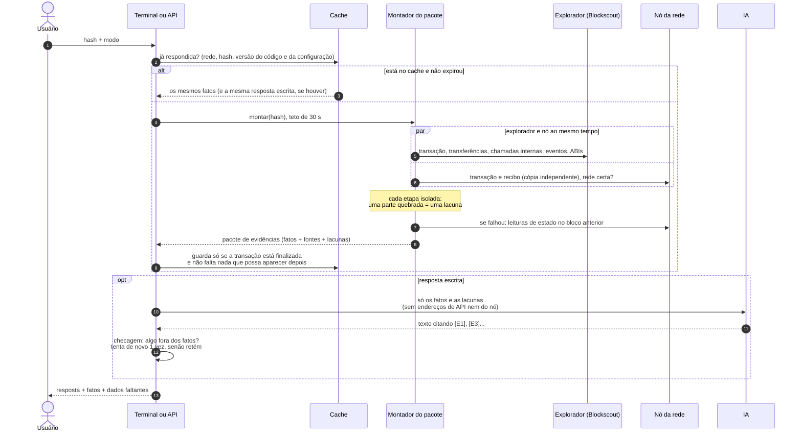
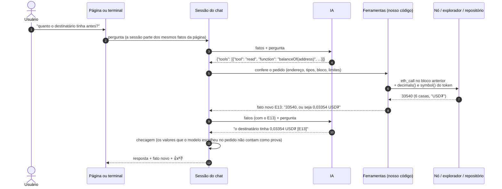
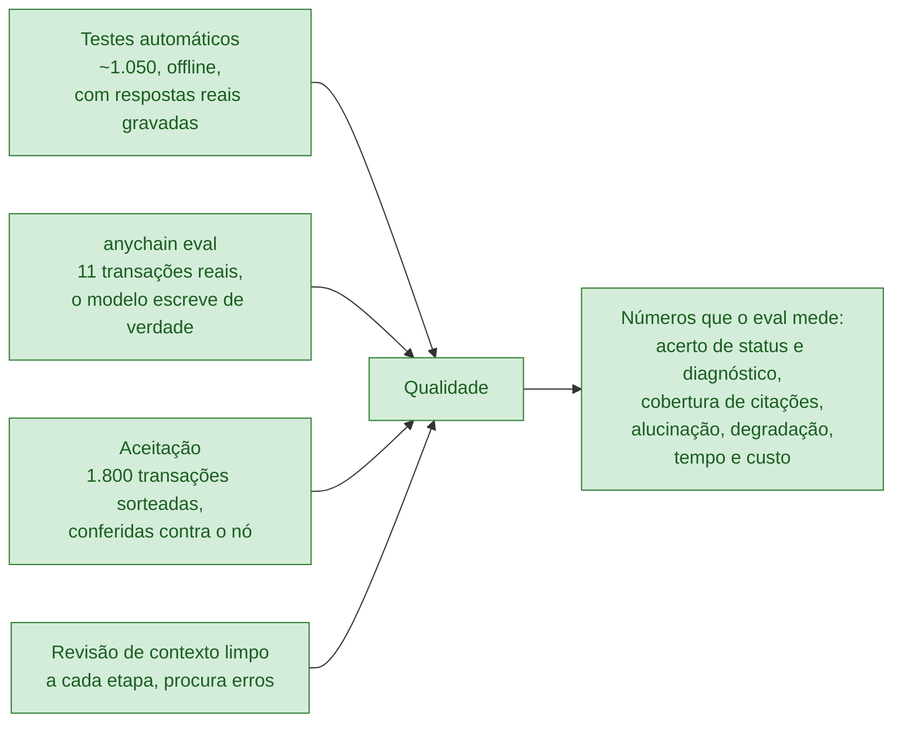
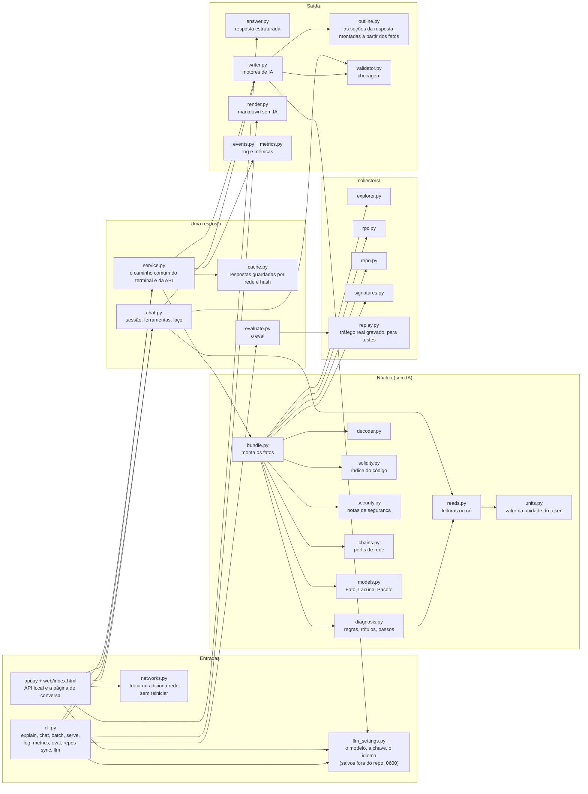
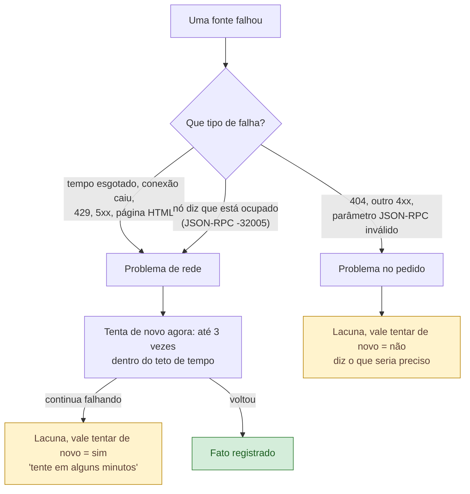
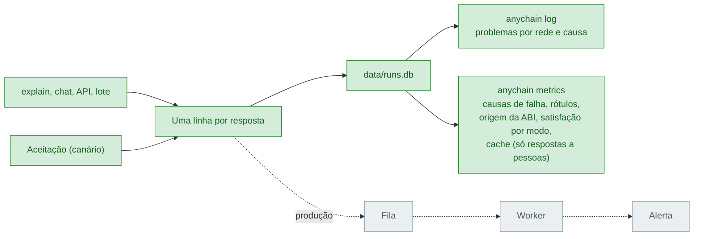

# Arquitetura

Documento vivo: atualizado ao fim de cada fase. Versão em português de `ARCHITECTURE.md` (a versão em inglês é a da entrega).

As cores mostram o que já existe:

- **Verde**: construído e testado
- **Amarelo**: em construção nesta fase
- **Cinza**: fases seguintes
- Caixas brancas são só agrupamentos.

Estado atual: **fim da Fase 4** (08/10/2026): triagem (uma pergunta antes de responder, escolhida pelo código), linha do tempo do remetente em volta de uma falha, notas de gás, Dockerfile, README final e a rede privada de demonstração (Anvil + Blockscout próprio + BRLC atrás de um proxy, lida só com `configs/devnet.yaml`).

---

## 0. O que você está construindo, em um minuto

Um assistente que **explica uma transação de blockchain** para quem não é técnico (um lojista: "por que meu pagamento não passou?") e para quem é (um desenvolvedor, um auditor), em **qualquer rede EVM**, trocando só a configuração.

A ideia que guia tudo: **a IA não descobre nada, só escreve.** Quem descobre é o código, que dá para testar.

Por que assim:

- **Se a IA errar, a checagem pega.** Um número que não está nos fatos não chega ao cliente.
- **Se uma regra errar, dá para achar e corrigir com um teste.** Foi o que aconteceu na Fase 3: a avaliação achou uma regra que ignorava uma chamada interna sem gás; ela foi corrigida, e o caso real virou teste (decisões D50 e D51).
- **Quando falta dado, a resposta diz o que falta** ("o explorador não respondeu; tente de novo"), em vez de adivinhar.

---

## 1. A linha de montagem

Os mesmos passos, com as peças de cada um.

| Fase | O que entra |
|---|---|
| 1 (pronta) | configuração, coletores do explorador e do nó, decodificador, pacote de evidências, redator com IA, terminal |
| 2 (pronta) | diagnóstico de falhas, leituras de estado, repositórios, cascata de ABI, confiança de cada fato, checagem da resposta |
| 2.5 (pronta) | código da função, notas de segurança, ABIs de artefatos, controle de acesso, prazo pelo parâmetro, rótulos, passos por leitor, resposta estruturada |
| 3 (pronta) | cache e lote, métricas, API, chat com ferramentas, página, conversão para a unidade do token, avaliação, diagnóstico pela origem da falha, pergunta do usuário, página de impacto, demonstração gravada |
| 4 | **pronto:** triagem (endereço em vez de hash, "não recebi", palavras emprestadas de outro contrato), linha do tempo do remetente com padrões (tentou de novo e deu certo, aprovou e deu certo, falhas seguidas), notas de gás, Dockerfile, README final com conversas reais. rede privada de demonstração (`devnet/`). **Fica para depois:** trace do nó |

---

## 2. Como o diagnóstico decide (só quando a transação falhou)

Regras escritas em código, na ordem abaixo. Cada conclusão sai com um rótulo: **CONFIRMED** (provada pelo motivo decodificado ou por uma leitura no nó), **LIKELY** (sugerida por um padrão) ou **UNKNOWN** (não há dado para concluir, e a resposta diz o que falta).

Os passos 1 e 3 entraram depois que a avaliação mostrou o ponto fraco de partir só do texto do topo (decisão D51).

---

## 3. O que acontece num `explain`

As novas tentativas, o teto de tempo e os desvios, na ordem em que acontecem. Toda falha vira uma **lacuna**, nunca um erro técnico na tela.

---

## 4. O chat com ferramentas

Depois da explicação, a pessoa pode perguntar mais. **O modelo não executa nada**: quando precisa de um dado, pede em JSON, e o nosso código confere o pedido, executa e devolve como fato novo, com fonte.

Ferramentas: `read` (estado de um contrato), `code` (código de uma função), `file` (arquivo de um repositório configurado), `transaction` (outra transação). No máximo 3 por pergunta e 10 perguntas por conversa.

---

## 5. Como a qualidade é medida

Os resultados do eval ficam em `eval/report.md`; os da aceitação, em `docs/acceptance-report.md`.

---

## 6. Mapa do código

Qual arquivo faz o quê, e quem chama quem. Ordem sugerida de leitura: `service.py`, depois `bundle.py`, depois `diagnosis.py`.

---

## 7. Como uma lacuna é classificada

A marcação "vale tentar de novo" é o que permitiria, em produção, mandar para uma fila só as falhas de rede (decisão D11).

Além de "vale tentar de novo", cada lacuna leva uma **causa**, que é o que o log de eventos conta (decisão D24):

| Causa | O que quer dizer | É problema? |
|---|---|---|
| `source_unavailable` | a fonte não respondeu (tempo esgotado, 5xx, limite de uso) | sim, alerta se a taxa sobe |
| `source_error` | a fonte recusou ou mandou algo ilegível (4xx, erro do nó, campo faltando) | sim |
| `source_behind` | o explorador ainda não indexou, ou discorda do nó | sim, se persistir |
| `processing_error` | nosso código quebrou com aquele dado, ou nossa conta contradiz uma fonte | sim, sempre é defeito |
| `config_error` | a configuração não bate com as fontes (chain id ou tipo de rede errado) | sim |
| `pending` | a transação ainda não foi minerada | não |
| `not_interpretable` | sem ABI, lista truncada, campo desconhecido, hash não encontrado: limite esperado | não |

---

## 8. Log de eventos, métricas e alertas

Cada resposta vira uma linha num arquivo SQLite local: rede, hash, duração, lacunas com causa, rótulo e regra do diagnóstico, origem da ABI, estado do cache, modo, tokens, custo e o 👍/👎. `anychain log` mostra problemas; `anychain metrics` mostra os números do uso, cada um com o SQL que o calcula. Em produção o mesmo evento iria para uma fila, e um worker agregaria e alertaria: esse trecho é só desenho.

---

## Histórico deste documento

- **09/10/2026, depois da Fase 4 (D59 a D67):** rede privada montada como a da CloudWalk (nó local, Blockscout próprio, BRLC atrás de um proxy), lida só com um arquivo de configuração; o modelo e a chave de API escolhidos pelo terminal ou pela página, com o modelo vindo da lista do próprio provedor; modelos menores confiáveis por código (roteiro da resposta montado a partir dos fatos, só os próximos passos do leitor, citações normalizadas, fatos-chave obrigatórios); rede trocada ou adicionada pela página sem reiniciar; a página virou uma conversa em três versões (lojista, desenvolvedor, auditor); linguagem simples para o lojista. Novos no mapa do código: `outline.py`, `networks.py`, `llm_settings.py`.
- **08/10/2026, Fase 4 (D55 a D58):** triagem com uma pergunta escolhida pelo código; linha do tempo do remetente em volta de uma falha, com padrões ditos só sobre nonces contínuos; notas de gás (heurísticas); Dockerfile, testado num servidor; README final.
- **08/10/2026, Fase 3 até a T5 (D44 a D51):** seção 0 em linguagem simples; cache por rede e hash e lote; métricas com SQL; API local e página; chat com ferramentas executadas pelo nosso código; valores na unidade do token, lidos do próprio token; avaliação com 10 casos reais; diagnóstico que parte da origem da falha e diz todo sinal que a conclusão não explica. Novas seções: como o diagnóstico decide, o chat com ferramentas, como a qualidade é medida.
- **08/10/2026, fim da Fase 2.5 (D38 a D43):** código da função como fato, notas de segurança, ABI de artefatos, controle de acesso, prazo pelo parâmetro, rótulos, passos por leitor, resposta estruturada.
- **07/10/2026, fim da Fase 1:** primeira versão. Linha de montagem, sequência de um `explain`, mapa do código, classificação das lacunas.
- **07/10/2026, rodadas de revisão da Fase 1:** contratos delegados via EIP-7702 como fonte de ABI; conta sem código hoje nunca é dada como "sem código" no momento da transação (D18); a IA não recebe endereços de API nem do nó.
- **07/10/2026:** criada esta versão em português.
- **07/10/2026, objetos tipados (D21):** as respostas do explorador e do nó viram objetos tipados uma única vez, em `collectors/types.py`.
- **08/10/2026, Fase 2 (D24 a D37):** log de eventos, motores de IA, checagem da resposta, confiança de cada fato, leituras de estado, diagnóstico, repetição, repositórios, base de assinaturas, matriz de degradação.
- **07/10/2026, perfis por tipo de rede (D20):** a configuração declara o tipo de rede do Blockscout; perfis para seis tipos.
