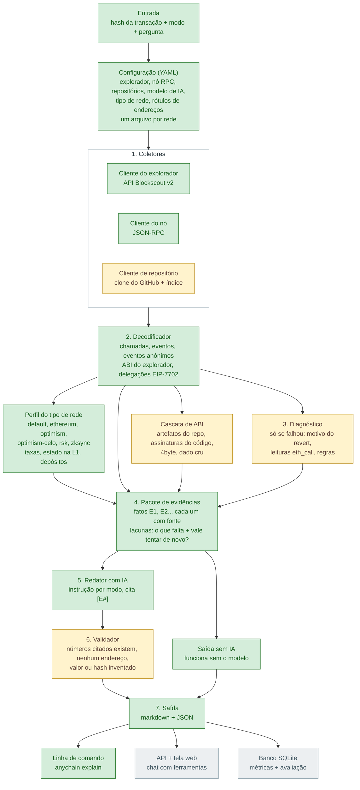
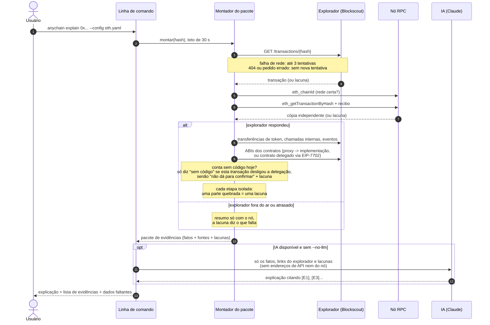
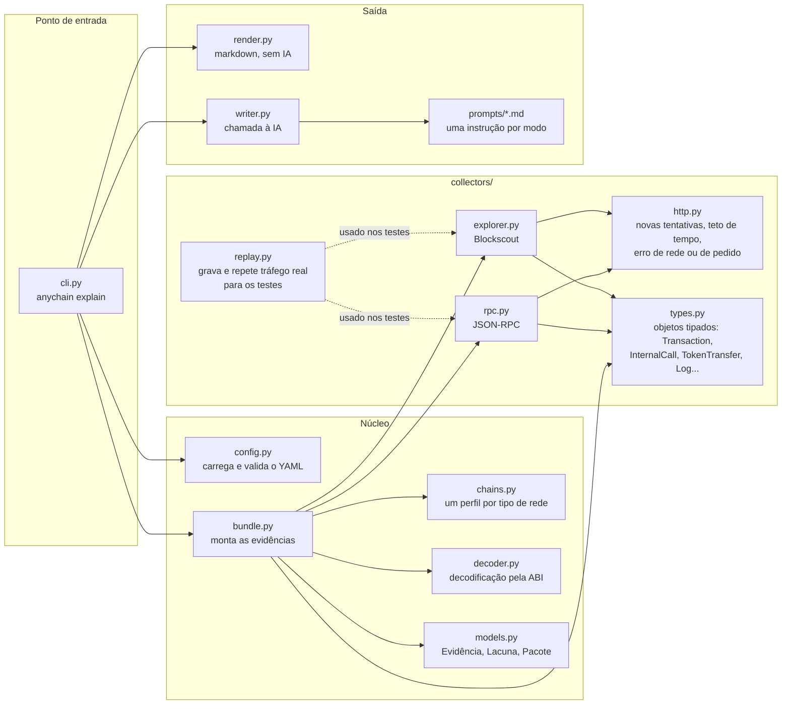
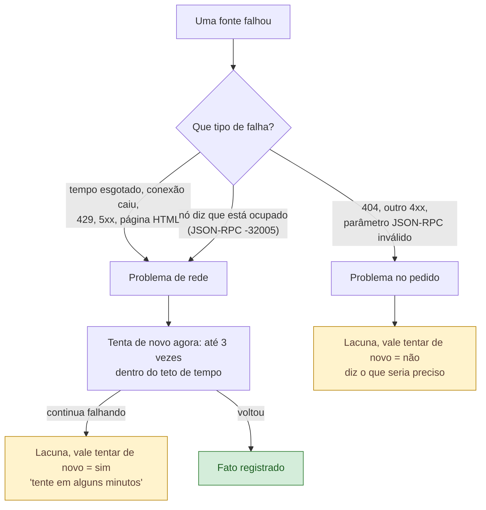

# Arquitetura

Documento vivo: atualizado ao fim de cada fase. Versão em português de `ARCHITECTURE.md` (a versão em inglês é a da entrega).

As cores mostram o que já existe:

- **Verde**: construído e testado
- **Amarelo**: próxima fase
- **Cinza**: fases seguintes
- Caixas brancas são só agrupamentos.

Estado atual: **fim da Fase 1** (07/10/2026).

---

## 1. A linha de montagem

Uma regra molda tudo: os fatos são coletados **sem nenhuma IA**, numerados e acompanhados da fonte. A IA só escreve o texto a partir desses fatos e, a partir da Fase 2, um validador confere se ela não inventou nada.

| Fase | O que entra |
|---|---|
| 1 (pronta) | configuração, coletores do explorador e do nó, decodificador com a ABI do explorador, pacote de evidências, redator com IA, linha de comando |
| 2 | diagnóstico de falhas, leituras de estado com `eth_call`, leitura dos repositórios, cascata completa de ABI, níveis de confiança, validador |
| 3 | API, tela web, chat com ferramentas, modos, SQLite + métricas, suíte de avaliação |
| 4 | perguntas de triagem, linha do tempo entre transações, notas de segurança, notas de gás |

---

## 2. O que acontece num `explain`

As novas tentativas, o teto de tempo e os desvios, na ordem em que acontecem. Toda falha vira uma **lacuna**, nunca um erro técnico na tela.

---

## 3. Mapa do código

Qual arquivo faz o quê, e quem chama quem. Ordem sugerida de leitura: `cli.py`, depois `bundle.py`, depois os coletores.

---

## 4. Como uma lacuna é classificada

A marcação "vale tentar de novo" é o que permitiria, em produção, mandar para uma fila só as falhas de rede (decisão D11).

---

## Histórico deste documento

- **07/10/2026, fim da Fase 1:** primeira versão. Linha de montagem, sequência de um `explain`, mapa do código, classificação das lacunas.
- **07/10/2026, rodadas de revisão da Fase 1:** contratos delegados via EIP-7702 como fonte de ABI; conta sem código hoje nunca é dada como "sem código" no momento da transação (decisão D18); a IA não recebe endereços de API nem do nó.
- **07/10/2026:** criada esta versão em português.
- **07/10/2026, objetos tipados (D21):** as respostas do explorador e do nó viram objetos tipados uma única vez, em `collectors/types.py`.
- **07/10/2026, perfis por tipo de rede (D20):** a configuração declara o CHAIN_TYPE do Blockscout; perfis para seis tipos de rede; rótulos de endereços na configuração.
